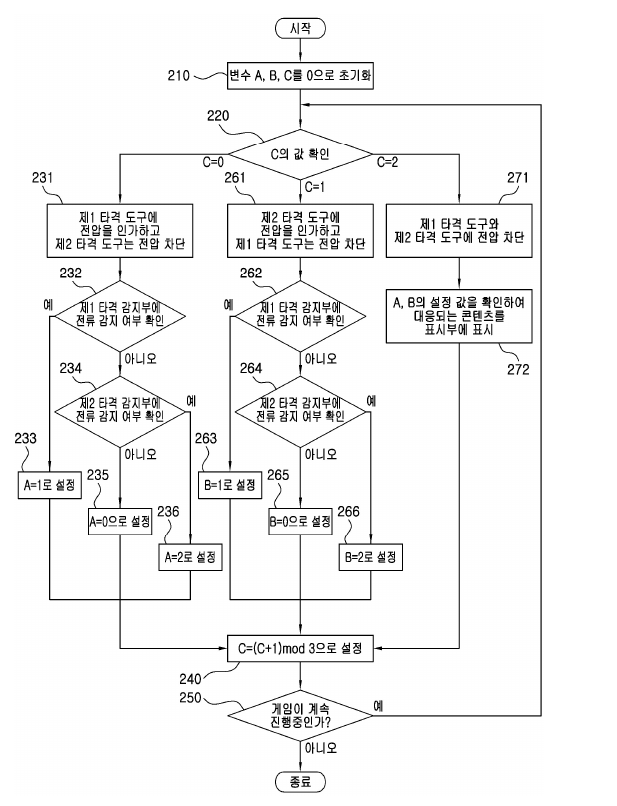
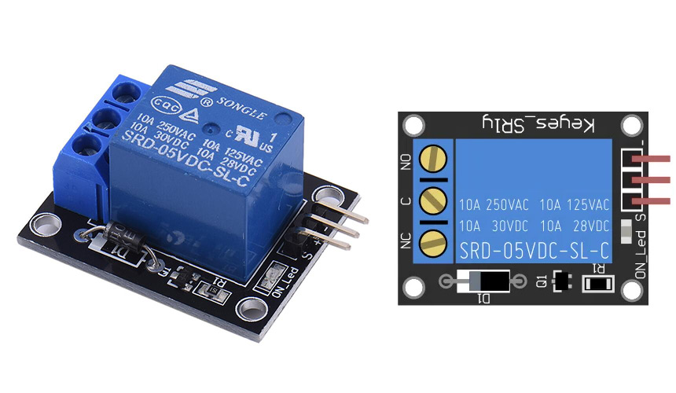
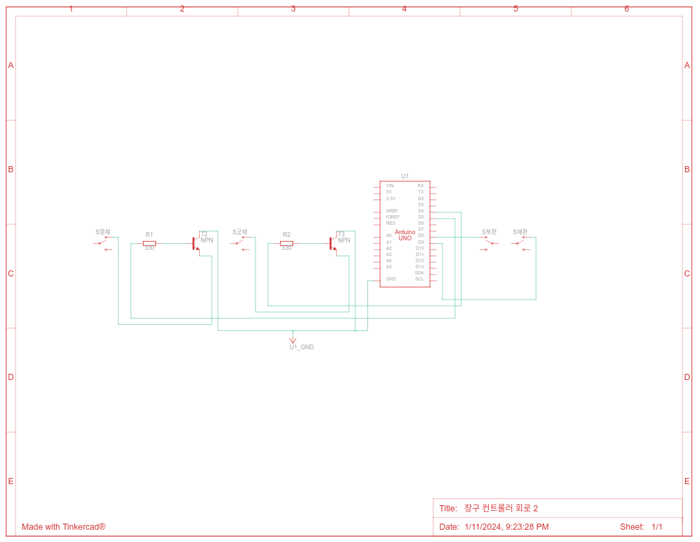
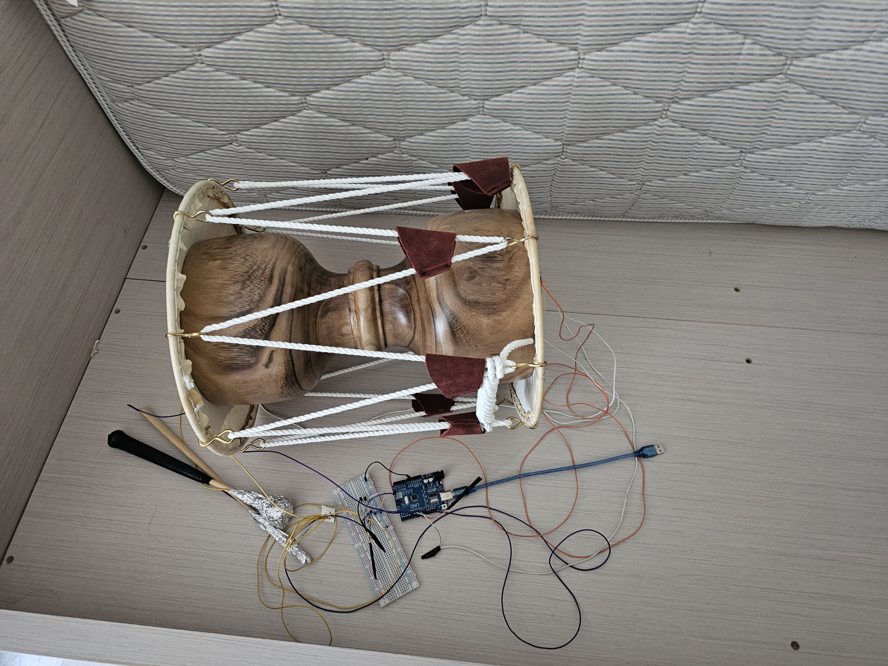

# 서문
문득 장구를 이용한 리듬 게임을 만들고 싶었다. 태고의 달인도 있는데 장구의 달인이 안 될 이유가 있을까? 그래서 군대 있을 때 계속 장구 게임을 상상만 하다가 복학하고 3학년 2학기에 캡스톤디자인 과목을 듣게 됐다.

3학년 2학기 캡스톤디자인 과목에서 게임 아이디어를 제시했지만, 다른 팀원들은 리스크가 너무 크다고 반대했다. 지금 막 개강했는데 하드웨어 개발부터 시작하면 십중팔구 프로젝트가 망할 것이라는 지적이였다. 반박하기에는 너무나도 맞는 말이였다. 그래서 그냥 받아들이고 "알고모여"라는 웹 어플리케이션 프로젝트를 하게 됐다. 의외로 교수님의 평가가 계속 호평이여서 손쉽게 A+를 받았다.

중앙대학교는 캡스톤디자인을 2번 해야 졸업이 가능하다. 그래서 4학년 1학기에도 캡스톤디자인을 해야 했는데, 이때 게임 아이디어를 다시 꺼내고 싶었다. 그러나 하드웨어도 없이 빈손으로 아이디어를 꺼낸다면 또다시 팀원들로부터 리스크 우려를 받을 것 같았다. 그래서 일단 프로토타이핑을 해서 설득해야 되겠단 판단이 들었다. 판단이 이루어졌으면 바로 실천해야 하지 않겠는가? 바로 당근마켓으로 45,000원짜리 어린이 장구를 샀고, 곧이어 아두이노랑 쿠킹호일, 그리고 몇가지 부품을 구매했다.

# 프로토타이핑
## 유선과 무선
내가 만드는 게임은 단순히 타격 여부만을 인식하지 않는다. "어떤 채로 어떤 면이 타격됐는가"를 인식한다. 즉, 다시 말해 열편으로 궁편을 친다면 "궁편이 타격됐다"라는 정보가 아닌 "열편으로 궁편이 타격됐다"라는 정보가 인식된다.

이를 구현하려면 채에도 센서가 있어야 된다. 그리고 이 센서는 게임 본체랑 연결되어야 한다. 어떻게 연결한 것인가? 무선과 유선 두가지 방법이 있다.

무선과 유선 각 두 가지 방법의 장단점은 다음과 같다.

|      |               무선              |                유선                |
|------|---------------------------------|------------------------------------|
| 장점 |         선이 걸리지 않음        |  정확도가 매우 높고 딜레이가 낮음  |
| 단점 | 너무 낮은 정확도 및 높은 딜레이 |           선이 걸리적거림          |

무선 통신은 정확도가 너무 낮다는 단점이 있다. 무선으로 채의 위치를 측정한다고 가정해보자. [Inpixion](https://www.inpixon.com/technology/standards/ultra-wideband)의 자료에서의 무선 위치 측정 시스템의 정확도와 레어턴시는 다음과 같다.

|          |    UWB   | Chirp (CSS) |  BLE  | Wi-Fi |
|----------|----------|-------------|-------|-------|
| 정확도   | 10~50 cm |     1~2m    | < 5 m |  10 m |
| 레이턴시 |  < 1 ms  |    < 1 ms   |  3~5s |  3~5s |

정확도가 너무 낮아서 무선 위치 측정 시스템은 쓸 수가 없다. 블루투스와 와이파이는 레이턴시때문에 리듬게임 컨트롤러로 쓸 수조차 없다.

'그렇다면 무선이되 다른 방법을 쓰면 되는 것 아닌가?'라는 생각이 들 수도 있는데, 내 머리로는 그렇게 할 수 있는 방법이 딱히 떠오르지 않았다. 그래서 그냥 유선으로 연결하기로 하고, 걸리적거리는 문제는 나중에 해결하기로 했다.

## 시분할
자, 이제 유선으로 채의 종류를 인식하기로 했다. 장구는 두 개의 채와 두 개의 접촉면이 있다. 이 경우 가능한 경우의 수는 총 몇 가지인가? 답은 아래 표에서 볼 수 있듯 9가지이다. 두 개의 채로 하나의 접촉면을 동시에 치는 경우(아래 표에서 5번, 9번)도 고려해야 하므로 9가지이다.

|    | 궁채 | 북채 |
|----|------|------|
| 1  |  X   |  X   |
| 2  | 궁면 |  X   |
| 3  | 북면 |  X   |
| 4  |  X   | 궁면 |
| 5  | 궁면 | 궁면 |
| 6  | 북면 | 궁면 |
| 7  |  X   | 북면 |
| 8  | 궁면 | 북면 |
| 9  | 북면 | 북면 |

전기는 색깔이 없다. 접촉면에서 흐르는 전기가 궁채에서 흐르는 전기인지 북채에서 흐르는 전기인지 알 수 없다. 그렇다면 접촉면에 닿은 채가 어떤 채인지 어떻게 구분해야 할까? 필자는 FDM(주파수 분할)과 TDM(시분할)을 생각했다. 처음엔 FDM을 생각했었는데, 아두이노로 구현하기에는 난이도가 높을 것 같아 비교적 구현이 손쉬운 TDM으로 결정했다.

### 알고리즘
시분할 알고리즘은 매우 단순하다.

1. 궁채에 전기를 흘리고 북채에 전기를 흘리지 않는다.
1. 북면에 전기가 흐르는 지 확인한다. 북면에 전기가 흐르면 궁채는 북면에 접촉하고 있다.
1. 궁면에 전기가 흐르는 지 확인한다. 궁면에 전기가 흐르면 궁채는 궁면에 접촉하고 있다.
1. 북채에 전기를 흘리고 궁채에 전기를 흘리지 않는다.
1. 북면에 전기가 흐르는 지 확인한다. 북면에 전기가 흐르면 북채는 북면에 접촉하고 있다.
1. 궁면에 전기가 흐르는 지 확인한다. 궁면에 전기가 흐르면 북채는 궁면에 접촉하고 있다.
1. 2, 3, 5, 6번에서의 정보를 종합하면 어떤 채가 어떤 접촉면에 접촉하고 있는 지 알 고 있다.

이를 도식도로 나타내면 다음과 같다.

위를 실제 회로로 구현하기 위해서는 특정 회로를 신호로 열거나 닫을 수 있어야 한다.

### 릴레이
특정 회로를 신호로 열거나 닫는 대표적인 부품은 릴레이이다. 릴레이는 일종의 스위치 역할을 하는 부품으로, 전자석을 이용하여 회로를 열거나 닫는다.

매우 직관적이고 만들기 쉬워서 처음에 릴레이를 시도했었다. 그러나 문제가 있었다. 릴레이는 딜레이가 너무 크고(5ms) 결정적으로 딱따구리 같은 소음이 난다. 위 알고리즘을 빠르게 무한반복해야 하는 특성상 릴레이 열고닫기를 반복하니 전자석 딱딱거리는 소리가 무한히 들리는 것이었다.

### 트랜지스터
그래서 주변 분들의 조언을 받아 트랜지스터를 이용했다. 주변 분께 딜레이가 1ms이하인 릴레이가 있나고 여쭤보니, 그 분께서 그런 릴레이는 없으니 트랜지스터를 쓰라고 답변해주신 것이 큰 도움이 됐다. 트랜지스터는 라디오 만들 때나(증폭) 쓰는 건 줄 알았는데 검색해보니 트랜지스터도 스위치처럼 쓸 수 있음을 알게 됐다.

NPN 트랜지스터와 저항으로 약간의 시행착오를 겪으니 잘 인식됐다. 트랜지스터를 이용한 회로는 아래와 같다.

위 회로에서 궁채, 열채, 북편, 채편 기호는 각각의 부위에 붙은 전도체를 의미한다.

## 전도체
전기가 흘려야 하니 채와 접촉면에는 전도체 물질을 부착해야 한다. 뭘 붙일까 고민하다가 [펌프 발판을 수작업으로 제작할 때 은박지를 이용했다는 글](https://blog.naver.com/b4crazy1/221481730264)이 생각났다. 그래서 다이소에서 쿠킹호일을 사다가 붙였다. 내구성은 썩 좋은 것 같진 않았지만 꽤 잘 인식됐다.

사진은 위와 같다. 사진에는 보이지 않지만, 장구의 면에도 은박지가 부착되어 있다.

# 결론
쿠킹호일과 NPN 트랜지스터, 저항, 그리고 아두이노를 이용해 장구 컨트롤러를 만들었다. 내구성은 썩 좋지 않았지만 인식은 잘 됐다. 2023년 겨울방학의 일이었다.