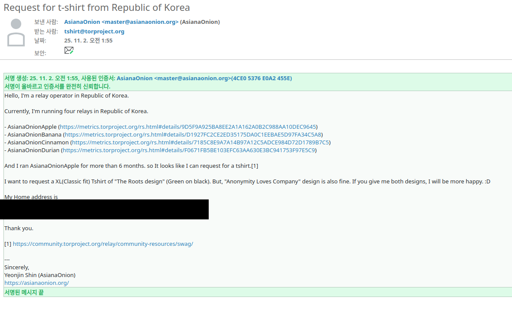
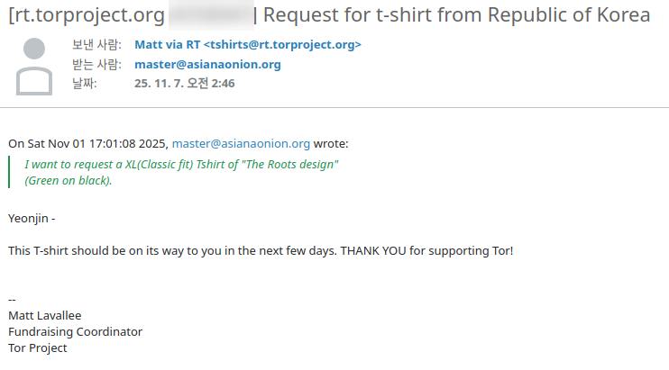
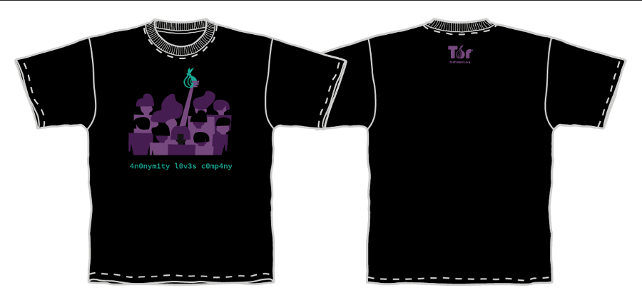
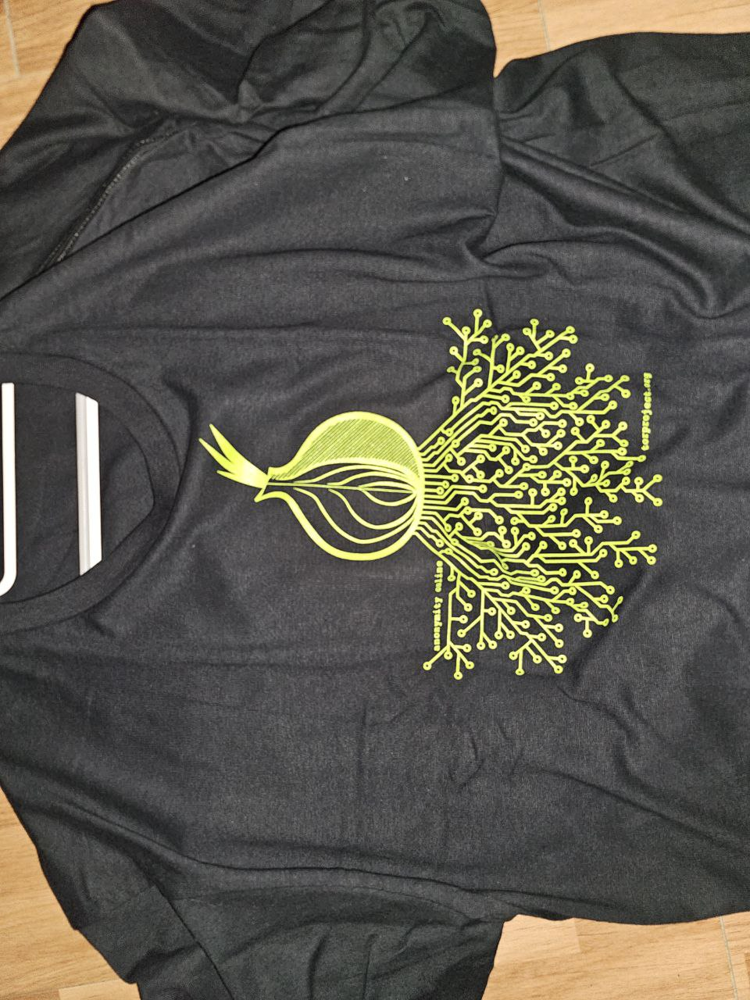
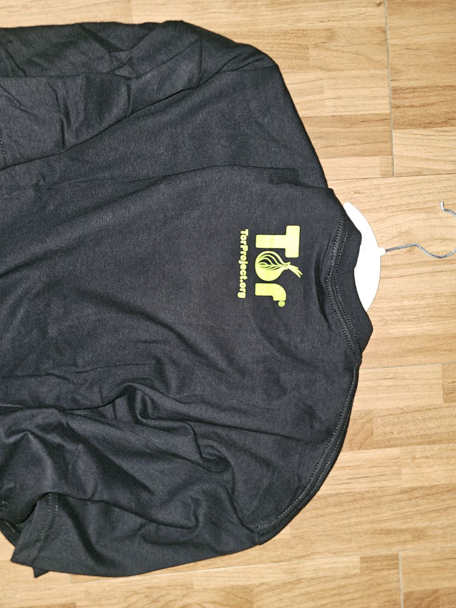

# 릴레이 운영
[Tor](torproject.org) 릴레이를 [운영하고 있다.](https://asianaonion.org/) VPS 3개로 간단히 굴리고 있는데, Tor 재단 홈페이지를 뒤적이다가 [이런 게시글](https://community.torproject.org/relay/community-resources/swag/)을 발견했다.

최소 6개월 이상 Tor 릴레이를 운영하면 티셔츠를 받을 수 있다고 한다. 어? 이거 완전 나잖아.
그래서 바로 메일을 보냈다.

그리고 며칠 지나고 나서 자격이 된다는 메일이랑 곧 보내주겠다는 메일을 받았다.

그리고 잊을 때쯤 되면 추적 링크가 온다.

티셔츠가 USPS e-Packet? 아무튼 이런 걸로 오는 것 같은데 택배 추적이 정확하진 않다. 아무래도 한국 내까지 추적이 되진 않는 것 같다.

저 메일 받고 며칠 지나면은 티셔츠가 우편함에 꽂혀있다. 일이 있어 집을 비웠던 관계로 정확히 언제 왔는 지는 모르겠다.

# 티셔츠
티셔츠 디자인은 [여기서](https://gitlab.torproject.org/tpo/community/team/-/wikis/tshirts) 고를 수 있다. 이쁜 디자인이 많다.

얘로 골랐다.

얘도 이뻐서 고민 많이 했는데 결국 위에 거로 골랐다.

실제로는 아래와 같이 왔다.

뒤에는 Tor재단 로고가 있다.

# 결론
암튼 티셔츠를 받았다. 메일에 2개 줄 수 있으면 2개 달라고 적었는데 1개만 준다. 좋았다. 끝~