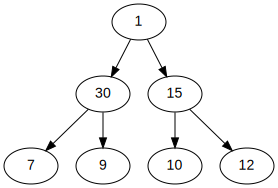
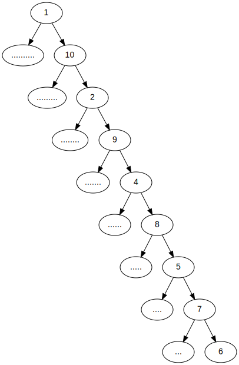
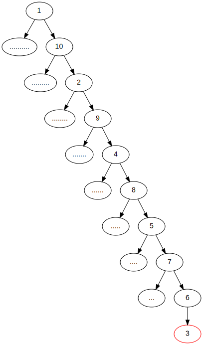
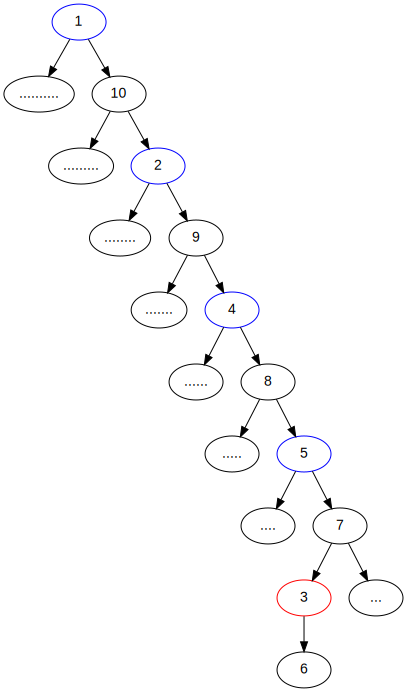
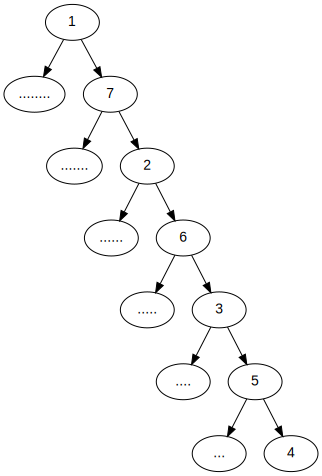
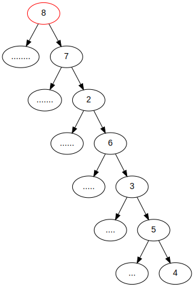
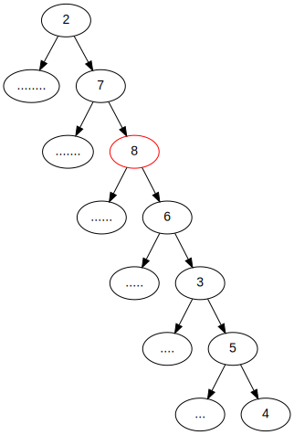
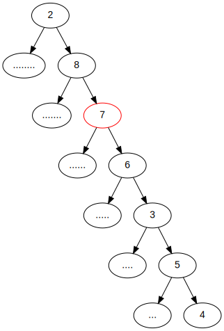
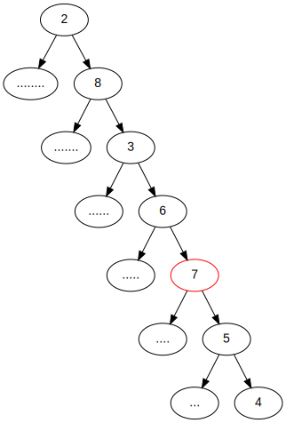
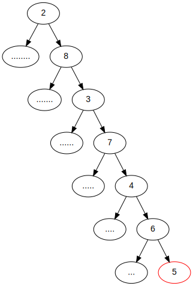

# 백준 7662번 이중 우선순위 큐 문제
[백준 이중 우선순위 큐 문제](https://www.acmicpc.net/problem/7662)는 본 글에서 소개하는 최소-최대 힙(Min-max heap)을 구현하면 풀리는 문제이다.

필자는 최소-최대 힙을 시도하기에 앞서 다른 방법(최소 힙이랑 최대 힙 두개 만들기)을 시도했었으나 능력이 부족한 탓인지 실패했다. 따라서 이 방법의 정석적인 풀이방법인 최소-최대 힙을 [영문 위키백과의 Min-max heap 문서](https://en.wikipedia.org/wiki/Min-max_heap)을 보면서 풀었다. 이 글에서는 최소-최대 힙에 대해 설명하고 C++ 구현 코드를 제시하고자 한다.

## Heap이란?
Heap은 최소값이나 최대값 등을 빠르게 구하기 위해 만들어진 완전 이진 트리(Complete binary tree) 형태의 자료구조이다. 일반적으로 Heap이라고 말할 때는 보통 최대 힙(Max-heap)이나 최소 힙(Min-heap)을 의미한다. 이 중에서 최대 힙은 다음과 같이 구현된다.

 - 추가
   1. 추가하고자 하는 값을 힙 자료구조의 맨 뒤에 넣는다.
   1. 추가된 값을 부모 원소와 비교한다.
      - 만약 부모보다 작거나 같다면 멈춘다.
      - 만약 부모보다 크다면 부모와 자리를 바꾼다.
   1. 다시 2번으로 되돌아간다.
- 최대값 삭제
   1. 최대 힙에서는 루트에 있는 값이 항상 최대값이다. 따라서 루트를 삭제하고 힙의 맨 뒤에 있는 값을 루트로 옮긴다. 이 루트로 옮겨진 원소를 A라 하자.
   1. A를 가장 큰 값을 가진 자식과 비교한다.
      - 만약 자식이 더 크다면 자식과 자리를 바꾼다.
      - 만약 자식이 더 작거나 같다면 멈춘다.
   1. 다시 2번으로 되돌아간다.

최소 힙은 위에서 비교하는 방향만 돌려서 다음과 같이 구현하면 된다.

 - 추가
   1. 추가하고자 하는 값을 힙 자료구조의 맨 뒤에 넣는다.
   1. 추가된 값을 부모 원소와 비교한다.
      - 만약 부모보다 크거나 같다면 멈춘다.
      - 만약 부모보다 작다면 부모와 자리를 바꾼다.
   1. 다시 2번으로 되돌아간다.
- 최소값 삭제
   1. 최대 힙에서는 루트에 있는 값이 항상 최소값이다. 따라서 루트를 삭제하고 힙의 맨 뒤에 있는 값을 루트로 옮긴다. 이 루트로 옮겨진 원소를 A라 하자.
   1. A를 가장 작은 값을 가진 자식과 비교한다.
      - 만약 자식이 더 작다면 자식과 자리를 바꾼다.
      - 만약 자식이 더 크거나 같다면 멈춘다.
   1. 다시 2번으로 되돌아간다.

위와 같이 구현된 최대 힙에서는 항상 가장 큰 값을 가진 원소가 루트가 되며, 최소 힙에서는 가장 작은 값을 가진 원소가 항상 루트가 된다. 즉, 최대 힙을 이용하면 주어진 값들 중에서 최댓값을 빠르게 구할 수 있으며, 최소 힙을 이용하면 최소값을 빠르게 구할 수 있다.

그렇다면 여기서 궁금증이 하나 생긴다, 최댓값과 최소값을 둘 다 빠르게 구할 수 있는 힙 자료구조가 있을까? 이에 대한 정답은 본 글에서 소개하고자 하는 최소-최대 힙이다.

## 최소-최대 힙
Min-max heap(최소-최대 힙)은 홀수번째 레벨(이하 Min-level)의 원소는 그 밑에 있는 모든 원소들보다 작거나 같은 값을 가지며, 짝수번째 레벨(이하 Max-level)의 원소는 그 밑에 있는 모든 원소들보다 크거나 같은 값을 가진다. 루트가 있는 레벨은 Min-level이다.



위 예시를 보자. Min-level에 있는 원소는 그 하위에 있는 원소들보다 작은 값을 가지며, Max-level에 있는 원소는 그 밑에 있는 원소들보다 큰 값을 가진다.

따라서 우리는 최소-최대 힙에서 (루트는 Min-level이므로) 루트는 항상 힙의 최소값을 가지며, 2번째 레벨에 있는(루트 바로 밑 레벨에 있는) 두 원소 중 가장 큰 값이 힙의 최댓값을 나타냄을 알 수 있다.

## 구현
최소-최대 힙의 구현은 다음과 같이 이루어진다.

 - 추가
    - 새로운 값을 추가할 때는 힙의 맨 뒤에 값을 추가한 뒤 그 값을 위로 올려가며(Push-up) 적절한 자리를 찾아 힙 자료구조를 완성한다.
 - 최소/최대값 확인
    - 최소값을 읽을 때는 루트의 값을 읽는다.
    - 최대값을 읽을 때는 루트의 직계자식들 중 가장 큰 값을 읽는다.
 - 삭제
    - 최소값이나 최대값을 삭제한 뒤에는, 힙의 맨 뒤에 있는 값을 최소값이나 최대값이 있던 자리로 옮기고, 그 값을 아래로 내려가며(Push-down) 적절한 자리를 찾아 힙 자료구조를 완성한다.

위를 구현하기 위해서는 Push-up과 Push-down 알고리즘을 구현해야 한다.

## Push-Up의 구현
예시를 들어 설명해보자. 다음 예시를 보라.



위 그래프는 유효한 최소-최대힙이다. 위 그래프의 맨 끝에 3이라는 값을 추가했다고 가정해보자. 3을 추가할 시 아래와 같이 변한다.



값을 추가하는 순간 유효한 최소-최대 힙이 아니게 된다. Min-level에 있는 6보다 더 작은 자식 3이 생기기 때문이다.

따라서 이 그래프를 다시 최소-최대 힙으로 만들기 위해서는 원소 3을 위로 올려가면서 적절한 위치를 찾아야 한다.
먼저, 추가한 값인 3이 Min-level에 있는 부모(6)보다 작다. 이는 최소-최대 힙의 조건과 모순되므로 부모와 추가된 값의 위치를 서로 바꿔준다.



추가된 값이 부모와 바꿔지면서 Min-level로 옮겨졌음을 확인할 수 있다. 이제 3은 3을 루트로 하는 서브트리 내에서만큼은 무결하다. 왜나하면, 최소-최대 힙에서 루트에 있던 값은 그 밑의 모든 값들보다 작거나(혹은 루트의 레벨에 따라서, 크거나) 같아야 한다는 특징이 있는데, 이 값이 (6에서 3으로) 더 작아지는 것이 이 특징을 깨트리지 않음은 자명하기 때문이다.

그러나, 위 그래프는 아직도 최소-최대 힙의 특징을 만족하지 못한다. 5번째 레벨의 원소(값: 4)와 7번째 레벨의 원소(값: 5)를 보라. 5번째 레벨과 7번째 레벨은 홀수번째 레벨이므로 Min-level이다. 따라서 원소 4의 하위 원소들은 모두 값이 4보다 크거나 같아야 하고, 원소 5의 하위 원소들도 모두 값이 5보다 크거나 같아야 한다. 그러나 원소 3은 5나 4보다 크거나 같지 않다. 원소 5(혹은 4)의 하위 원소인 원소 3이 5(혹은 4)보다 작은 값을 가지므로 최소-최대 힙의 조건과 모순된다.

따라서 이 모순을 해결하기 위해, 원소 3을 상위의 Min-level에 있는 원소(위 사진에서 파란색으로 표시된 원소들)들과 비교하며 적절한 위치를 찾아야 한다. 원소 3을 파란색으로 표시된 원소들과 비교하여 위로 올려가며 적절한 위치를 찾은 결과는 다음과 같다.


최소-최대 힙에 값 6이 성공적으로 추가됐음을 알 수 있다.

따라서 우리는 이 예시가 다음과 같은 알고리즘에 따라 이루어졌음을 알 수 있다.

 1. 추가된 값(이하 원소 A)을 힙의 맨 뒤에 추가한다. A가 Max-level에 추가됐다고 가정하자.
 1. A를 부모 원소와 비교한다.
    1. A가 부모 원소보다 작거나 같다면 A와 부모 원소를 서로 바꾼다.
 1. A를 A의 조부모 원소와 비교한다.
    - 만약 A가 Min-level이고 A가 조부모보다 더 작다면, A와 조부모의 위치를 서로 바꾼다.
    - 만약 A가 Max-level이고 A가 조부모보다 더 크다면, A와 조부모의 위치를 서로 바꾼다.
    - 서로 바꿀 필요가 없다면 멈춘다.
 1. 3번으로 되돌아간다.

위 알고리즘을 A가 처음에 Min-level에 추가된 경우로까지 확장하면 다음과 같다.

 1. 추가된 값(이하 원소 A)을 힙의 맨 뒤에 추가한다.
 1. A를 부모 원소와 비교한다.
    - A가 Max-level에 있고, A가 부모 원소보다 작거나 같다면 A와 부모 원소를 서로 바꾼다.
    - A가 Min-level에 있고, A가 부모 원소보다 크거나 같다면 A와 부모 원소를 서로 바꾼다.
 1. A를 A의 조부모 원소와 비교한다.
    - 만약 A가 Min-level이고 A가 조부모보다 더 작다면, A와 조부모의 위치를 서로 바꾼다.
    - 만약 A가 Max-level이고 A가 조부모보다 더 크다면, A와 조부모의 위치를 서로 바꾼다.
    - 서로 바꿀 필요가 없다면 멈춘다.
 1. 3번으로 되돌아간다.

위 알고리즘이 최소-최대 힙의 Push-Up 알고리즘이다. 이 알고리즘을 이용하면 원소의 추가를 구현할 수 있다.

## Push-down의 구현
Push-down은 다음과 같이 구현한다. 먼저, 아래와 같은 유효한 최소-최대 힙이이 있다고 가정하자.



위 힙에서 최소값을 제거하고 최소값이 있던 자리(루트)에 8을 넣었다고 가정해보자. 그 결과는 다음과 같다.



위 그래프는 유효한 최소-최대 힙이 아니다. 따라서 이 그래프를 최소-최대 힙으로 만들기 위해서는 원소들의 위치를 아래로 내려가며 조정해야 한다.

먼저, 위 그래프에서 원소 8은 Min-level에 있다. 따라서 원소 8의 자식(Child)과 손자(Grandchild)들중 가장 작은 값을 가진 원소를 확인한다. 이 원소는 2이다.

원소 2가 원소 8보다 더 작음은 Min-max heap의 조건에 모순된다. 따라서 원소 2와 원소 8의 위치를 서로 바꾼다.



원소 2와 원소 8의 위치를 서로 바꾸었지만 Max-level에 있는 원소 7이 자식인 원소 8보다 더 작은 값을 가지고 있다. 이는 모순이다. 따라서 원소 7과 원소 8의 위치를 서로 바꾼다.



이제 원소 2는 하위에 있는 모든 원소들보다 작은 값을 가지고, 원소 8은 하위에 있는 모든 원소들보다 큰 값을 가진다. 원소 7 위로는 Min-max heap의 조건과 모순되는 원소가 없다. 그러나 원소 7의 밑을 보라. 원소 7은 Min-level이므로 원소 7 하위의 모든 원소들보다 작거나 같은 값을 가져야 한다. 그러나 원소 6, 3, 5, 4로 인하여 이 조건이 만족되지 않는다.

이를 해결하기 위해 원소 7의 자식과 손자들 중 가장 작은 값을 가진 원소를 찾는다. 이러한 원소는 3이다. 원소 3으로 인하여 원소 7이 Min-level의 조건을 만족하지 않으니 원소 3과 원소 7의 위치를 서로 바꾼다.



원소 7의 부모는 Max-level이므로 원소 7의 부모는 원소 7보다 더 크거나 같은 값을 가져야 한다. 그러나 부모 원소의 값은 6이므로 7보다 크거나 같은 값이 아니다. 따라서 원소 7과 6의 위치를 서로 바꾼다.


이제 원소 6 위의 모든 원소들 (2, 8, 3, 7)들은 Min-level과 Max-level의 조건을 만족한다. 그러나 원소 6은 Min-level의 조건을 만족하지 못한다. 따라서 원소 6이 Min-level의 조건을 만족하도록 하기 위해 원소 6의 자식과 손자들 중 가장 작은 값을 가진 원소를 찾는다. 이 원소는 4이다. 원소 4는 Min-level인 원소 6의 손자임이도 불구하고 6보다 작은 값을 가지고 있다. 이는 모순이므로 원소 6과 4의 위치를 바꾼다.


원소 6의 부모를 보자. 원소 6의 부모의 값은 5인데, 이 부모 원소는 Max-level에 있다. 이는 모순이다. 이 모순을 해결하기 위해 원소 6과 원소 5의 위치를 서로 바꾼다.



이제 유효한 Min-max heap이 만들어졌음을 확인할 수 있다. 이 예시로부터 알고리즘을 도출하면 다음과 같다.

 - 주어진 원소 A에 대하여, 만약 A가 Min-level이라면
   1. 자식과 손자들 중 가장 작은 값을 가진 원소를 B라고 하고 B의 인덱스를 `i`라고 하자.
   1. 만약 B가 A보다 더 작은 값을 가지고 있고.
      - B가 A의 손자라면
        1. B와 A의 위치를 서로 바꾼다.
        1. 만약 A가 A의 부모보다 더 큰 값을 가지고 있다면, A와 A의 부모의 위치를 서로 바꾼다.
        1. `i`번째 위치에 있는 원소에 대하여 이 알고리즘을 다시 실행한다.
      - B가 A의 손자가 아니라면 B와 A의 위치를 바꾸고 끝낸다.

위 알고리즘을 A가 Max-level인 경우로까지 확장하면 다음과 같다.

 - 주어진 원소 A에 대하여
    - 만약 A가 Min-level이라면
        1. 자식과 손자들 중 가장 작은 값을 가진 원소를 B라고 하고 B의 인덱스를 `i`라고 하자.
        1. 만약 B가 A보다 더 작은 값을 가지고 있고.
            - B가 A의 손자라면
                1. B와 A의 위치를 서로 바꾼다.
                1. 만약 A가 A의 부모보다 더 큰 값을 가지고 있다면, A와 A의 부모의 위치를 서로 바꾼다.
                1. `i`번째 위치에 있는 원소에 대하여 이 알고리즘을 다시 실행한다.
            - B가 A의 손자가 아니라면 B와 A의 위치를 바꾸고 끝낸다.
    - 만약 A가 Max-level이라면
        1. 자식과 손자들 중 가장 큰 값을 가진 원소를 B라고 하고 B의 인덱스를 `i`라고 하자.
        1. 만약 B가 A보다 더 큰 값을 가지고 있고.
            - B가 A의 손자라면
                1. B와 A의 위치를 서로 바꾼다.
                1. 만약 A가 A의 부모보다 더 작은 값을 가지고 있다면, A와 A의 부모의 위치를 서로 바꾼다.
                1. `i`번째 위치에 있는 원소에 대하여 이 알고리즘을 다시 실행한다.
            - B가 A의 손자가 아니라면 B와 A의 위치를 바꾸고 끝낸다.

## 소스코드 (C++)
이제 위에서 PushUp과 Pushdown의 구현 알고리즘을 살펴봤으므로 아래와 같이 C++로 구현할 수 있다.
```cpp
#include <iostream>
#include <algorithm>
#include <cmath>
#define INT_SWAP(a,b) int tmp = a; a = b; b = tmp
#define SWAP_HEAP(a,b) INT_SWAP(heap[(a)], heap[(b)])
#define IS_MIN_LEVEL(index) ((int)(std::log2(index)) % 2) == 0

int heapCount = 0; // How many elements in the heap?
int heap[1000001]; // Heap, starting from index 1

void insertHeap(int item); // inserts an element
void popMin(); // removes minimum element
void popMax(); // removes maximum element
int seekMin(); // reads minimum element
int seekMax(); // reads maximum element

/**
 * Implementation of min/max pop using push-down
 */

// Picks index of largest(or smallest) child(or grandchild) of given element
int pickLargetOrSmallestDescendantIndex(int index, bool largest) {
    int resultIndex = index * 2, resultValue = heap[index * 2];
    int candids[] = { // Children and grandchildren
        index * 2 + 1, // Right child
        index * 4, // 1st grandchild (Left child of left child)
        index * 4 + 1, // 2nd grandchild (Right child of left cihld)
        index * 4 + 2, // 3rd grandchild (Left child of right child)
        index * 4 + 3 // 4th grandchild (Right child of right child)
    };

    for (auto candidIndex: candids) {
        if (candidIndex > heapCount)
            continue; // If it's invalid index, continue

        if (largest && resultValue < heap[candidIndex]) {
            resultValue = heap[candidIndex];
            resultIndex = candidIndex;
        } else if (!largest && resultValue > heap[candidIndex]) {
            resultValue = heap[candidIndex];
            resultIndex = candidIndex;
        }
    }

    return resultIndex;
}

void pushDownMin(int index);
void pushDownMax(int index);

void pushDown(int index) {
    if (IS_MIN_LEVEL(index)) {
        pushDownMin(index);
    } else {
        pushDownMax(index);
    }
}

void pushDownMin(int index) {
    if (index * 2 <= heapCount) { // if has children
        int m = pickLargetOrSmallestDescendantIndex(index, false);

        if (m >= index * 4) { // if m is a grandchild
            if (heap[m] < heap[index]) {
                SWAP_HEAP(m, index);
                if (heap[m] > heap[m / 2]) {
                    SWAP_HEAP(m, m / 2);
                }
                pushDown(m);
            }
        } else if (heap[m] < heap[index]) {
            SWAP_HEAP(m, index); 
        }
    }
}

void pushDownMax(int index) {
    if (index * 2 <= heapCount) { // if has children
        int m = pickLargetOrSmallestDescendantIndex(index, true);

        if (m >= index * 4) { // if m is a grandchild
            if (heap[m] > heap[index]) {
                SWAP_HEAP(m, index);
                if (heap[m] < heap[m / 2]) {
                    SWAP_HEAP(m, m / 2);
                }
                pushDown(m);
            }
        } else if (heap[m] > heap[index]) {
            SWAP_HEAP(m, index); 
        }
    }
}

void popMin() {
    if (heapCount <= 0)
        return;
    // Removes minimum element
    heap[1] = heap[heapCount--];
    // Push down root element to make the heap valid min-max heap
    pushDown(1);
}

void popMax() {
    if (heapCount <= 0)
        return;
    
    int index;
    if (heapCount == 1)
        index = 1;
    else if (heapCount == 2)
        index = 2;
    else
        index = heap[2] > heap[3] ? 2 : 3;
    
    // Removes maximum element
    heap[index] = heap[heapCount--];
    // Push down to root element make the heap valid min-max heap
    pushDown(index);
}

/**
 * Implementation of insertion using push-up
 */

void pushUpMin(int index) {
    if (index >= 4 && // if index >= 4, it must have a grandparent.
        heap[index] < heap[index / 4]) {
            SWAP_HEAP(index, index / 4);
            pushUpMin(index / 4);
        }
}

void pushUpMax(int index) {
    if (index >= 4 && // if index >= 4, it must have a grandparent.
        heap[index] > heap[index / 4]) {
            SWAP_HEAP(index, index / 4);
            pushUpMax(index / 4);
        }
}

void pushUp(int index) {
    if (index != 1) {
        if (IS_MIN_LEVEL(index)) {
            if (heap[index] > heap[index / 2]) {
                SWAP_HEAP(index, index / 2);
                pushUpMax(index / 2);
            } else {
                pushUpMin(index);
            }
        } else {
            if (heap[index] < heap[index / 2]) {
                SWAP_HEAP(index, index / 2);
                pushUpMin(index / 2);
            } else {
                pushUpMax(index);
            }
        }
    }
}

void insertHeap(int item) {
    heap[++heapCount] = item;
    pushUp(heapCount);
}


int seekMin() {
    return heap[1];
}

int seekMax() {
    if (heapCount == 1) {
        return heap[1];
    } else if (heapCount == 2) {
        return heap[2];
    } else {
        return std::max(heap[2], heap[3]);
    }

}

int main() {
    std::cin.tie(NULL);
    std::ios_base::sync_with_stdio(false);

    // How many test cases?
    int t;
    std::cin >> t;

    for (int i = 0; i < t; i++) {
        // How many operations?
        int q;
        std::cin >> q;
        
        // Process operations
        for (int j = 0; j < q; j++) {
            char c;
            int data;
            std::cin >> c >> data;
            
            switch(c) {
                case 'I':
                    insertHeap(data);
                    break;
                case 'D':
                    if (data == -1)
                        popMin();
                    else
                        popMax();
            }
        }

        // Print result
        int max = seekMax(), min = seekMin();

        if (heapCount == 0)
            std::cout << "EMPTY\n";
        else
            std::cout << max << ' ' << min << '\n';
        heapCount = 0;
    }
}
```