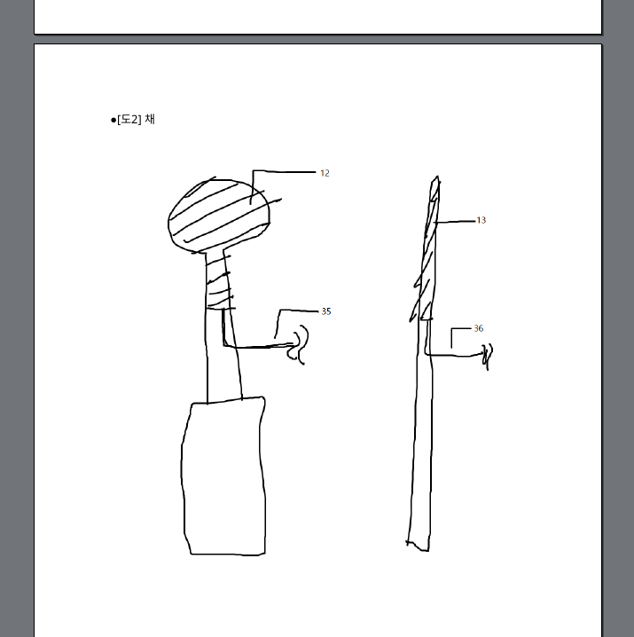
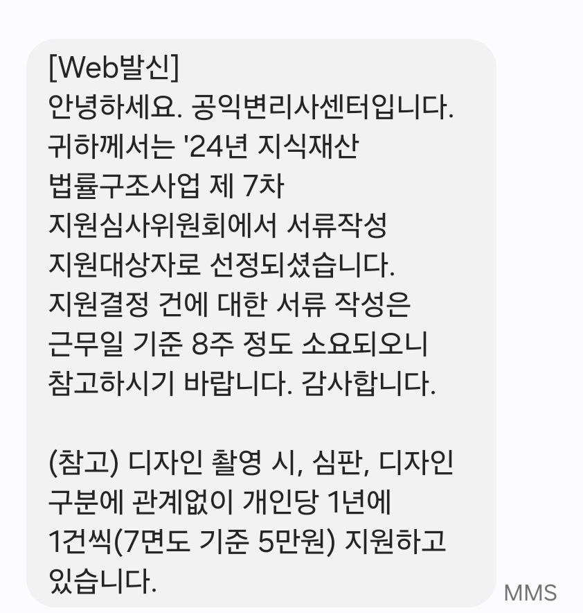
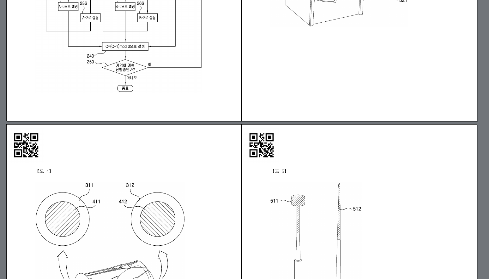

# 들어가는 글
많은 사람들은 특허 출원과 특허 등록의 차이를 모른다. 회사 입학 원서를 예시로 들자면, 삼성전자 공채에 원서를 내는 걸 특허 "출원"이라고 하고, 삼성전자 공채에 최종합격하는 것을 특허 "등록"이라고 한다.

2024-1학기 캡스톤디자인 프로젝트를 하면서 프로포절 발표할 때 특허 출원을 넣으면 입 털기 좋을 것 같다는 생각이 들었다. 그래서 장구 컨트롤러 프로토타입을 기반으로 특허를 출원했다.

# 명세서부터 특허출원까지
## 특허고객등록
특허를 출원하려면 특허고객번호가 필요하다. [특허고객등록](https://www.patent.go.kr/smart/jsp/ka/prestep/codeapp/CodeAppView.do)을 하면 된다. 쉽게 할 수 있다.

## 가출원
특허 출원은 의외로 어렵지 않다. 특허는 가출원할 수 있다. 대충 휘갈겨 쓴 임시명세서로 가출원하면 특허출원번호가 바로 나온다. 청년이면 출원료 85% 감면도 해준다.

일단 캡스톤디자인 프로포절과 프로포절 발표에서 입을 터는 게 목표였기에 출원번호를 얻는 게 중요했다. 그래서 [마크다운](https://en.wikipedia.org/wiki/Markdown)으로 대충 쓰고 PDF로 바꿔서 제출했다. 내용은 다른 명세서의 목차를 참고해 나름 특허명세서의 구조를 갖추려 노력했다.

위는 임시명세서에 넣었던 도식이다. [draw.io](https://draw.io)로 그리다가 짜증나서 그림판(Krita나 GIMP 둘 중 하나인데 정확히는 기억나지 않는다.)으로 휙휙 그렸다.

대충 쓴 임시명세서를 특허청에서 제공한 전자출원프로그램으로 출원했다. **전자출원은 무조건 윈도우에서만 가능하며(리눅스 wine 시도시 오류남), 공인인증서가 반드시 필요하다.** 본인이 윈도우를 끔찍이 싫어하는 자유 소프트웨어 원리주의자라면 우편으로 출원하면 되긴 한데, 나는 그렇게까지 하고 싶진 않아서 그냥 VM에 윈도우 설치하고 전자출원했다.

덧붙여서, 공개되는 특허서류에 주소가 공개되는 데 이게 싫은 사람은 특허청 홈페이지에서 주소가 구 단위까지 공개되도록 바꿀 수 있다. 참고하도록 하자.

## 공익변리 지원하기
특허는 명세서가 가장 중요하다. 명세서를 제대로 쓰려면 변리사를 고용해야 하는데 변리사를 고용하는 건 비싸다. 대학생이 이용할 수 있는 변리사 무료지원 사업은 크게 다음 세가지가 있다.
 - [공익변리사센터](https://pcc.or.kr)
 - [공익변리](https://free.kpaa.or.kr/)
 - [대한변리사회 공익상담](https://www.kpaa.or.kr/kpaa/publicbenefit/readConsultcalInfosByMonth.do): 전화나 방문으로 가능하다.

공익변리사센터는 학과장 확인서를 받아야해서 귀찮고, 공익상담은 방문하려니 가기가 귀찮고 전화로 하려니 설명하다가 열불이 터질 것 같다는 생각이 들었다. 그래서 공익변리사센터의 [서류작성지원](https://pcc.or.kr/home/content.do?menu_cd=000014) 사업을 이용했다. 공익변리사센터에서 제시하는 양식을 다 채우고 필자가 작성했던 임시명세서를 추가로 제출했다.

지원사업에 선정되면 위와 같이 문자가 온다. 변리사님께서 제출한 서류를 읽다가 이해가 안되면 전화를 해서 물어볼 수 있다. 친절히 답해주면 된다. 명세서는 선정 후 2~3개월 정도 기다리면 이메일로 받을 수 있다.

변리사님이 써준 정식명세서는 위와 같이 변리사 사무소에서 그림을 깔끔하게 다시 그려준다. 분량도 31페이지 정도로 굉장히 상세하게 써주신다. (참고로 본인이 쓴 임시명세서는 6페이지였다.)

## 정식출원
임시출원된 특허를 정식출원된 특허로 바꾸는 방법은 다음 두가지 방법이 있다.
- 임시출원된 특허를 정식명세서로 보정하기
- 임시출원된 특허를 근거로 우선권주장하여 별도의 정식특허 출원하기

두번째 방법의 존재를 몰라서 첫번째 방법으로 할 생각이었는데 공익변리사센터에서 배정받은 변리사님과 통화하던 중 여쭤보니 두번째 방법으로 하는 게 좋을 것 같다는 답변을 들었다. (모든 경우에 그런 건 아니고 특허 케이스마다 다를 것이다. 내 경우에는 그랬다.) 그래서 기존특허를 근거로 우선권주장하여 정식명세서로 출원했다.

## 심사
이제 기다리기만 하면 된다. 순번 기다리는데 최소 1년 반 정도 걸린다. 운 좋으면 한번에 통과되고 운 안 좋으면 의견제출통지서가 날라온다. 지금도 기다리고 있는데 한번에 통과될 지 안 될지는 잘 모르겠다.

# 후기
특허를 "출원하는 것" 자체는 쉽다. 근데 등록되는 건 어렵다. 출원은 그리 어렵지 않으니 여러분도 특허를 한번 출원해보면 좋을 것 같다.

프로포절 발표에서 입 털려고 출원한 거였는데 청자들에게 큰 영향이 있었는 지는 잘 모르겠다.

## (번외) 리듬게임의 정의
아래 문단은 내가 특허명세서 쓸 때 작성한 리듬게임의 정의의 초안이다.

> "리듬게임"은 조작 지시가 음악의 흐름에 따라 제시되고, 이용자는 지시에 따라 입력장치(예: 키보드, 마우스, 악기를 모방한 입력장치, 발로 누르는 버튼, 버튼, 터치스크린 등)를 조작하며, 최대한 많은 조작 지시를 정해진 타이밍에 최대한 근접한 시간에 수행하는 것을 목표로 하는 게임을 의미한다. 그리고 "아케이드 리듬게임"은 리듬게임 중 일정한 장소에서 일정한 시설을 갖추고 제공되는 게임을 의미한다.

위 정의를 변리사님이 살짝 수정하고 교정한 최종 버전은 다음과 같다.

> 리듬 게임이란, 조작 지시가 음악의 흐름에 따라 제시되고, 사용자는 지시에 따라 입력 장치(예: 키보드, 마우스, 악기를 모방한 입력 장치, 발로 누르는 버튼, 버튼, 터치스크린 등)를 조작하며, 최대한 많은 조작 지시를 정해진 타이밍에 성공시키는 것을 목표로 하는 게임을 의미한다. 그리고 아케이드 리듬 게임이란 리듬 게임 중에서도 일정한 장소(예: 오락실)에서 일정한 시설을 갖추고 제공되는 게임을 의미한다.

혹여나 다른 사람에게 도움이 될까싶은 마음에 적어둔다. 누군가에게 도움이 됐으면 좋겠다.