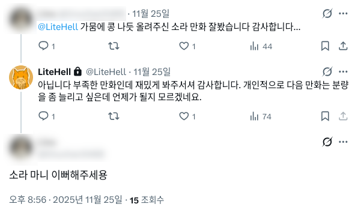

# 들어가는 글
이름 있는 기업에 취업을 하고나니, 삶이 단조로워졌다. 매일매일 일하다 보니 진짜 시간이 없더라.

그래서 할 이야기가 딱히 많을 것 같진 않지만, 그래도 회고를 해보려 한다.

# 프로그래밍
올해도 많은 양의 코드를 작성했다.

## 일
올해의 대부분을 일하는 데 보냈지만 공개적으로 할 수 있는 이야기가 그리 많진 않다. 그러니 그냥 대충 열심히 일했다...정도로 요약하겠다.

## 모교 멘토링
모교 직무박람회 특강에서 간단히 강의하고, 캡스톤디자인 과목에 산업체 멘토로서 참여했다. 직무박람회 특강은 솔직히 불특정다수 앞에서 강의하다 보니 일반론적인 이야기밖에 해줄 수 있는 게 없다. 그래도 앞으로도 이런 기회가 오면 여유가 되는 한 참여하고 싶다.

## XabelFish

[slint](https://slint.dev/)를 이용하여 GUI를 만들어봤는데 버그가 너무 많다. 나중에 시간이 나면 수정하려 한다.

## 행사 참가
[FOSS for All 컨퍼런스](https://dev.events/conferences/foss-for-all-conference-2025-af0cgnb7)와 [DevFest 2025 Incheon](https://devfest25.gdgincheon.dev/) 행사에 참석했다. 

DevFest 2025 Incheon에서 재밌는 주제가 많았다.
특히 [데브파이브](https://devfive.kr/ko/) [CEO 오정민](https://github.com/owjs3901)님께서 발표하신 [DevUp UI](https://devup-ui.com/) 프로젝트가 인상깊었다.

일반적으로 React/Vue 등의 모던 프론트엔드 테크스택에서는 CSS 작성을 위해 [styled component](https://emotion.sh/docs/styled)나 [tailwindcss](https://tailwindcss.com/), 혹은 [CSS Module](https://github.com/css-modules/css-modules) 등을 이용한다. 그러나 styled component와 CSS Module는 스크립트(js)가 먼저 로드되어야 하거나[^1], 라이브러리 의존성이 필요하다는 단점이 있다.

따라서 이를 해결하기 위해 DevUp UI는 
1. 빌드 프로세스에서 코드를 분석한 뒤
1. 코드 분석결과에 기반하여 스타일들을 모두 css로 추출하고
1. 코드에서 스타일 관련 코드를 2번에서 생성된 class로 변경한다.

의 방식으로 라이브러리 의존성 및 런타임 오버헤드가 없는 코드를 생성한다. 즉, 결과물은 정적 CSS 파일이 생성되고, 코드는 정적 CSS 파일내의 클래스 이름만을 이용하도록 재작성된다.

코드 분석에서 되게 고생을 엄청 많이 하셨겠더라. 복잡한 JS 문법(예시: `style={{color: warning ? 'red' : 'inherit', border: borderSize + "px solid black"}})`)도 지원하는 점에서 완성도도 매우 높았다.

이 외에도 한글 점역을 자동화하는 [Braillify](https://braillify.kr) 프로젝트도 인상깊게 봤다. 테스트케이스 100% 통과가 안되는 걸 보니 확실히 프로젝트가 도전적이구나라는 생각이 들었다. 나중에 이 분과 함께 커피챗하는 시간을 가져보고 싶다.

# 취미
## 서브컬쳐 행사 참가
올해 말 [일러스타 페스](https://illustar.net/)나 [코믹월드](https://comicw.co.kr/) 등의 서브컬쳐 행사에 참가하기 시작했다. 12월 AGF, 10월 수원 서코, 10월 일러페스 이렇게 참가했다.

개인적으로는 서코보다 일러페스에서 굿즈를 많이 사게 되는 것 같다. 코스프레하는 사람들도 많지만 그건 내 주요 관심사가 아니고, 그보다는 부스에 관심이 많다. 특히 만화나 일러스트집을 좋아한다. 근데 부스를 둘려보면은 회지보다는 키링/엽서 같은 팬시류 굿즈가 많았다.

왜 그런지는 이해한다. 나도 한때 만화동아리 부회장 완장차고 만화 찍먹해봤으니까... 만화 그리는 게 시간이 정말 많이 든다.

다만 그럼에도 불구하고 만화 회지를 그려서 부스를 차려보고 싶다는 생각은 든다. 내 그림 실력이 미천한지라 사람들이 많이 사줄 지는 모르겠지만... 꿈 하나쯤은 가질 수 있는 것 아니겠는가?

어찌됐건 행사가면 확실히 재미는 있다. 주로 킨텍스라 왔다갔다하기 귀찮긴 하지만... 앞으로도 시간이 날때마다 들르지 않을까 싶다.

## 만화
최근에 2차 창작 만화를 하나 그렸는데 반응이 꽤 좋았다. 트위터로 멘션까지 받은 적은 이번이 처음이였다. 

그래서 만화를 한편 더 그리려 한다. 분량도 좀 더 많이 해서. 언제가 될 지는 모르겠다만 언젠가 완성해서 공개하려 한다.

부스도 차려서 팔면 더 좋은데... 회지 하나만 가지고 부스 차린 건 본 적이 없다. 애초에 수요가 있긴 할까? 트위터 소규모 통판으로 만족해야 하나? 뭐 암튼 이건 나중에 생각해보려 한다.

# 결론
그림을 좀 더 많이 그릴 생각이다. 최근에 [와콤 무빙크](https://estore.wacom.kr/ko-kr/wacom-movink-13-dth135k0c.html)를 싸게 샀는데 확실히 액정 타블렛이 좋긴 좋더라. 새로 산 액정 타블렛도 자주 쓸겸 그림을 좀 더 그리려 한다.

---
[^1]: 다만 이는 Server-side Rendering으로 해결할 수 있다. [emotion 라이브러리는 Server-side Rendering을 기본 지원한다.](https://emotion.sh/docs/ssr) 또한 CSS Module도 빌드과정에서 CSS 파일을 추출하게 하면 (예시: [Webpack의 MiniCssExtractPlugin](https://webpack.js.org/plugins/mini-css-extract-plugin/)) 문제가 되지 않는다.