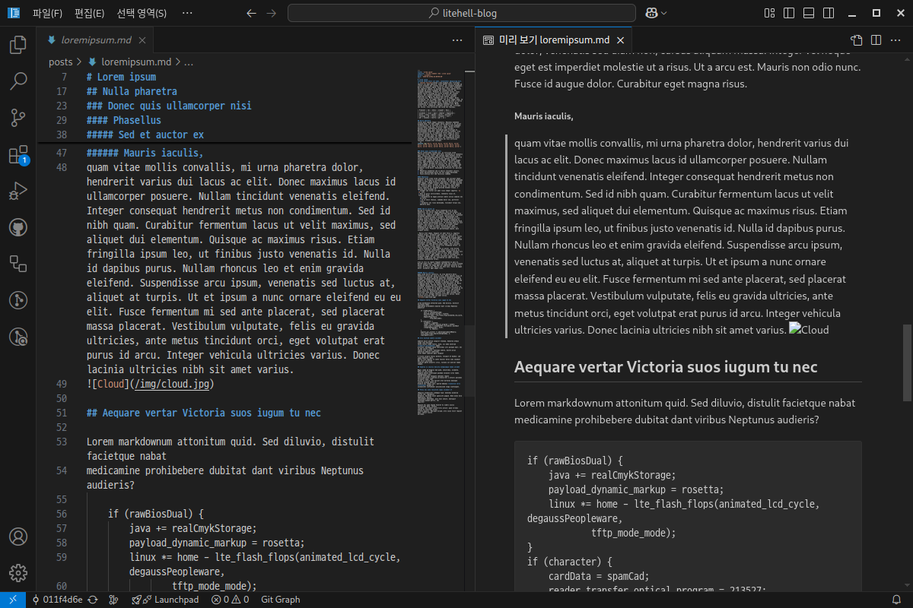
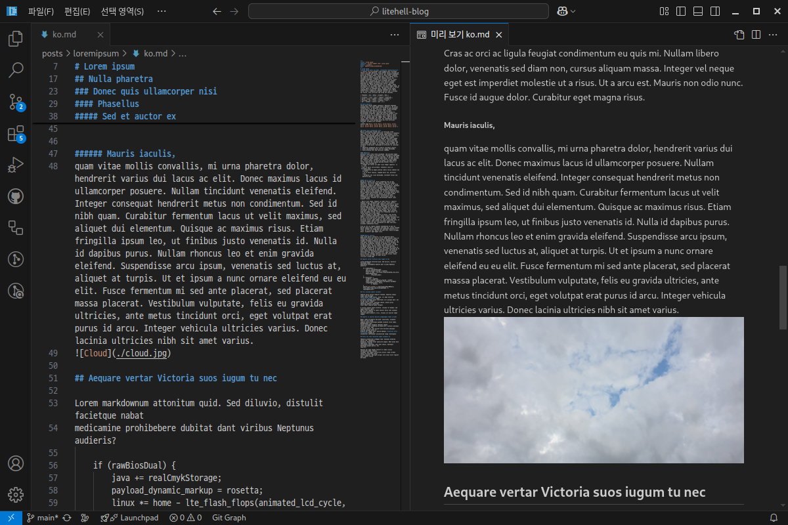

# 개론
기존 블로그는 [next.js](https://nextjs.org/)를 이용했다. next.js만의 기능을 활용하기 위해서라기보단 그냥 SSG(Static Site Generation) 편하게 하려고 next.js를 썼다. 

다 좋은데 한가지 불편한 점이 있다. 이미지를 첨부할 때 귀찮다는 것이다.

## 왜 귀찮은가?
필자는 블로그 글을 작성할 때 VS Code를 쓴다.

next.js는 `public/` 안에 이미지를 넣어야 한다. 그리고 블로그 글은 `posts/`에 쓴다.
따라서 VS Code 내에서 마크다운 미리보기를 열면 다음과 같이 이미지가 표시되지 않는다.



어떻게 해결할 수 있을까?

# 재작성
쿨타임도 돌았겠다. 그냥 블로그를 다시 만들면 된다. 고치는 것보다 새로 만드는 게 더 재밌을 것 같았다.

이번에는 webpack 대신 esbuild를 쓰려 한다. esbuild가 더 빠르다고 들어서 한번 써보려 한다. esbuild는 configuration 파일을 쓰지 않고 명령행에 모든 옵션을 지정한다. 따라서 package.json에 그냥 명령행 옵션을 다 때려박았다. (스크립트 파일을 만들어도 되지만 옵션이 그리 많지 않아서 그럴 필요성을 못 느꼈다. 나중에 옵션이 좀 많아지면 스크립트 파일로 분리하려 한다.)

## 구상
내 블로그는 딱히 동적인 컨텐츠가 없다. 그래서 이번에는 순수 HTML로만 출력하도록 작성했다.

순수 HTML로 출력되는 클래식한 방법은 템플릿 언어를 이용하는 방법이다. 하지만 템플릿은 타입(Type)이 견고하지 못하기 때문에 유지보수가 어렵다. 예시로 다음 코드는 Typescript 빌드 과정에서 오류가 발생하지 않는다.

```ts
const exampleTemplateString = 'Hello, {{name}}!'
var template = Handlebars.compile(exampleTemplateString);
console.log(template({ Name: "John Doe" }));
```

또한 프론트엔드를 여러 컴포넌트로 나누어 개발하는 데에는 템플릿 언어보다 React나 Vue 같은 모던 프레임워크 라이브러리가 더 적합하다. 이 또한 템플릿 언어가 Type이 견고하지 않음에서 기인한다. React나 Vue 같은 건 컴포넌트 매개변수 잘못 적으면 바로 IDE에 빨간 줄이 쳐지는 데 템플릿 언어는 그렇지 않다. 물론 React나 Vue를 쓰면 styled-component나 Module CSS 같은 걸 쓸 수 있는 점도 있다.

그렇다면 React를 이용하여 개발하되 결과물은 JS가 필요없는 순수 HTML로 출력할 수 있을까?

### renderToStaticMarkup
당연히 가능하다. React에서 제공하는 [renderToStaticMarkup](https://react.dev/reference/react-dom/server/renderToStaticMarkup) 함수를 이용하면 된다. 이를 이용하면 React 컴포넌트들이 렌더링된 HTML 코드를 얻을 수 있다.

Javascript가 없는 HTML 코드이니 상호작용은 불가능하며, 또한 hydration에도 이용될 수 없다. hydration을 염두에 둔다면 [renderToString](https://react.dev/reference/react-dom/server/renderToString)을 이용해야 한다.

## 구조
따라서 다음과 같은 구조로 작성했다.
1. 게시글 목록을 가져와서 정렬한다.
1. 게시글 목록에서 이용가능한 route(e.g. `/post/loremipsum`, `/category/Linux/1`)들을 모두 계산한다.
    ```ts
    export default async function getRoutes(posts: BlogPost[]) {
    const totalPages = Math.ceil(posts.length / postCountPerPage);

    return [
        "/",
        "/tags",
        "/categories",
        "/license",
        ...range(1, totalPages).map((i) => `/page/${i}`),
        ...posts.map((i) => i.name).map((i) => `/post/${encodeURIComponent(i)}`),
        ...getTagRoutes(posts),
        ...getCategoryRoutes(posts),
    ];
    }
    ```
1. 정적 파일들(robots.txt, 이미지 파일 등)을 복사한다.
1. 각 route별로 html 파일을 생성한다.
1. RSS/Atom/JSON 피드를 생성한다.

# 결론


보다시피 마크다운 미리보기에 이미지가 잘 보인다. 굿~

Javascript가 이전보다 많이 줄어든(사실상 없는) HTML이긴 하지만 댓글을 작성하려면 Javascript를 활성화해야 한다. 이는 GitHub Site를 이용하여 호스팅하는 이상 어쩔 수 없다.

어쨌든 해피엔딩~

# TO-DO
devServer를 똑바로 만들어야 한다. 지금은 만들다가 말아서... 나중에 시간 날때 완성해야 한다.

지금 코드는 Blue-Green 전략으로 수정이 생기면 재빌드하는 그런 코드로 짜다가 말았는데 지금 생각해보니 헛짓거리 같다. 다시 만들어야지...