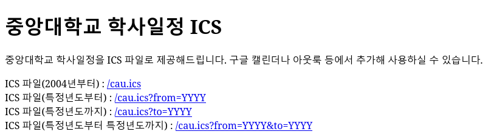
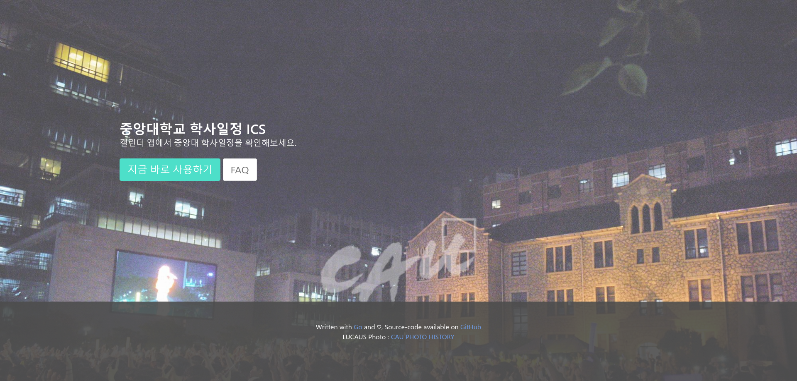
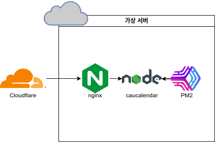

# 들어가는 글
나는 캘린더 앱을 적극적으로 활용한다. 시간이나 약속을 머릿속으로만 관리하면 잘 잊어버리기 때문에 캘린더 앱을 적극적으로 활용하고 있다.

그렇게 캘린더 앱을 적극적으로 쓰다가 대학교에 입학했다. 시험기간이나 수강정정기간 같은 것도 캘린더 앱에 뜨면 좋겠는데 이걸 직접 추가하는 건 귀찮았다. 그래서 [중앙대학교 학사일정 페이지](https://www.cau.ac.kr/cms/FR_CON/index.do?MENU_ID=590)를 크롤링하는 어플리케이션을 작성했다. 그리고 캘린더 앱과 내 어플리케이션을 연동하는 데에는 iCalendar 파일 포맷을 이용했다.

## iCalendar
[Google Calendar](https://calendar.google.com)나 [MS Outlook](https://outlook.com), 혹은 필자가 이용하는 [FastMail](https://www.fastmail.com)에서는 캘린더 기능을 제공한다. 이 캘린더 서비스들은 기본적으로 특정한 iCalendar 주소를 구독하는 기능을 지원한다. 즉, 다시 말해 필자가 구글 캘린더나 아웃룩에 iCalendar 파일 주소를 추가하면, 구글 캘린더나 아웃룩 서버가 주기적으로 iCalendar 주소에 접속해 동기화한다.

iCalendar 파일은 다음과 같은 형식으로 되어있다.
```
BEGIN:VCALENDAR
VERSION:2.0
TIMEZONE-ID:Asia/Seoul
X-WR-TIMEZONE:Asia/Seoul
X-WR-CALNAME:중앙대학교 학사일정
X-WR-CALDESC:calendar.puang.network에서 제공하는 중앙대학교 학사일정
CALSCALE:GREGORIAN
PRODID:adamgibbons/ics
METHOD:PUBLISH
X-PUBLISHED-TTL:PT1H
BEGIN:VTIMEZONE
TZID:Asia/Seoul
TZURL:http://tzurl.org/zoneinfo-outlook/Asia/Seoul
X-LIC-LOCATION:Asia/Seoul
BEGIN:STANDARD
TZOFFSETFROM:+0900
TZOFFSETTO:+0900
TZNAME:KST
DTSTART:19700101T000000
END:STANDARD
END:VTIMEZONE
BEGIN:VEVENT
UID:552361268d864ef42fff1bee5d295e073f7ab2b2@calendar.puang.network
SUMMARY:신정(공휴일)
DTSTAMP:20240825T081930Z
DTSTART;TZID=Asia/Seoul;VALUE=DATE:20220101
END:VEVENT
BEGIN:VEVENT
UID:eb57cfcaf7345c4ad83d1e7537dd81016db2d8a7@calendar.puang.network
SUMMARY:2022년 1학기 재입학 원서접수
DTSTAMP:20240825T081930Z
DTSTART;TZID=Asia/Seoul;VALUE=DATE:20220103
DTEND;TZID=Asia/Seoul;VALUE=DATE:20220107
END:VEVENT
END:VCALENDAR
```

위와 같은 식으로 iCalendar 아이템(`VCALENDAR`) 속에 여러 일정(`VEVENT`)들이 나열되어 있다. iCalendar 형식은 할일(`VTODO`)이나 일기(`VJOURNAL`)도 지원하지만 이 글에서는 다루지 않는다.

## [Koa.js](https://koajs.com/)를 이용한 첫 버전
첫 버전은 [Koa 프레임워크](https://koajs.com/)를 이용하여 간단하게 작성했다. 원래 이전에는 [express](https://expressjs.com/)를 썼었는데, express는 `async` 함수 핸들러가 바로 지원되지 않아서 약간 귀찮다는 단점이 있었기에 Koa 프레임워크를 이용했다.

이 프로그램에서 중요한 것은 iCalendar 파일을 제공하는 것이다. 따라서 그 외의 요소는 모두 부수적인 것이다. 그렇기에 프론트엔드는 다음과 같이 디자인이 극단적으로 되어있어도 상관없었다. (사진은 첫 커밋 버전의 메인 페이지이다.)



다만 그래도 위처럼 만드는 건 좀 심하니 [bulma CSS 프레임워크](https://bulma.io)를 이용해 아래와 같이 간단히 꾸몄다.



이때가 2019년 5~6월쯤이였다. 이때의 구조도는 다음과 같다.



당시 가상서버에서는 여러 웹서비스가 구동되고 있었기에, Host를 확인하여 알맞은 웹서비스로 트래픽을 전달해야 했다. 따라서 Nginx로 리버스 프록시가 동작하고 있었다.

위 사진에서 [PM2](https://pm2.io)는 프로세스가 꺼지면 다시 켜주는 역할을 한다. [리브레위키의 리버티엔진](https://github.com/librewiki/liberty-engine)에서 쓰길래 써봤다.

## 크롤링 스크립트 분리
초기에는 크롤링을 분리하기 귀찮아서, 그냥 요청이 들어올 때마다 학교 홈페이지에 접속해 학사일정 iCalendar 파일(이하 "ics 파일")을 제공했다. 그랬더니 어느순간 학교에서 서버 ip를 차단했다. 이게 2019년 11월 쯤의 일이였다.

그래서 크롤링하는 코드를 별도의 파일로 분리하고, crontab을 이용해 크롤링 스크립트가 주기적으로 실행되게 했다. 크롤링된 데이터는 [Sequelize](https://sequelize.org/) ORM을 이용해 저장했다.

## GitHub Action
학사일정 서비스에 버그가 생겼다고 캘린더 앱에서 잘 보이던 일정이 갑자기 사라지진 않는다. 그래서 동작에 이상이 생겨도 기존에 쓰던 사람들은 티가 잘 안난다.

그래서 동작이 정상적으로 이루어지는 지 주기적으로 확인하기 위해 다음과 같이 GitHub Action을 추가했다.
푸시나 커밋시가 아닌 특정 주기에 따라 반복되는 GitHub CI로 테스트가 주기적으로 이루어지도록 했다.

따라서 이를 통해 학교 홈페이지의 갑작스런 디자인/API 변경에도 대응할 수 있었다. 

```yml
name: Build and test

on:
  schedule:
    - cron: '0 19 * * *'
  push:

jobs:
  build:
    runs-on: ubuntu-latest
    steps:
      - uses: actions/checkout@v3

      - name: Build
        run: docker build --target test .
```

푸시나 커밋시가 아닌 cron으로 GitHub CI를 추가하여 학교 홈페이지의 갑작스런 디자인/API 변경에도 대응할 수 있도록 했다.
## 도커라이징
개인서버에서 돌아가던 서비스들을 다 도커 컨테이너에 감싸는 작업을 했었다. 그때 학사일정 ics 서비스도 도커 컨테이너로 감쌌다. crontab을 이용해 따로 돌아가던 크롤링 스크립트는 어플리케이션에 다시 집어넣어서, 어플리케이션 실행시 크롤링이 자동으로 주기적으로 실행되도록 수정했다. Docker에서 crontab을 쓰려면 약간 귀찮기 때문이다.

처음에는 `node:14` 도커 이미지를 기반으로 썼는데 값싼 가상서버에서 쓰기에는 디스크를 너무 많이 차지했다. 그래서 나중에 Alpine Linux 기반 도커를 기반으로 바꿨다. Alpine Linux 기반 이미지를 쓰니 디스크 소비량을 줄일 수 있었다. 이때가 2021년 2~3월인가 그랬을 것이다.

## Go 언어로의 재작성
그렇게 Javascript로 작성해서 잘 쓰다가 문득 이런 생각이 들었다. 'Go를 쓰면 더 빠르지 않을까?' Javascript는 인터프리터 언어이고, Go는 컴파일 언어이니, 알고리즘의 효율성이 유사하다는 가정하에 Go가 더 빠를 수도 있지 않을까란 생각이 들었다. 물론 Go 언어를 한 번 써보고 싶은 생각도 없진 않았다.

그래서 Go 언어로 학사일정 서비스를 재작성했다. 크롤러는 다음과 같이 고루틴을 이용하여 비동기적으로 동시에 구동되도록 했다.
```go
package main

import "time"

func crawlWorker() {
	for {
		time.Sleep(time.Hour * 1)
		fetchAllYears()
	}
}

func setupCrawller() {
	go crawlWorker()
}
```

## Docker를 이용한 테스팅
DigiCert CA 인증서와 관련된 문제가 있어 해당 CA 인증서를 추가하여 문제를 해결했었다. 물론 HTTP 요청시 인증서 오류를 모두 무시하도록 하는 방법도 있지만, 그 방법은 보안이 취약해지기에 채택하지 않았다.

다만 이렇게 CA 인증서를 추가하는 식으로 해결할 시에는 `go test -v` 명령어만으로 테스트를 할 수 없다는 문제점이 있었다. 그래서 [Docker를 테스트에도 활용할 수 있도록 다음과 같이 Dockerfile을 수정했다.](/post/docker_for_testing)

```dockerfile
FROM golang:alpine AS base

WORKDIR /app

# To avoid tls error from swedu.cau.ac.kr
COPY digicert-ca.pem /usr/local/share/ca-certificates/digicert-ca.crt
RUN cat /usr/local/share/ca-certificates/digicert-ca.crt >> /etc/ssl/certs/ca-certificates.crt

COPY go.mod go.sum ./
RUN go mod download && go mod verify

COPY static ./static
COPY *.go ./

FROM base AS deployment
RUN go build -v -o /app/app
CMD ["/app/app"]

FROM base As test

RUN go test -v ./...
```

## 서버리스
위와 같이 만들어서 굴리다가 추후 AWS Lambda 함수를 이용한 서버리스로 재작성했다. 이에 대해선 다음 글에서 이어서 작성하도록 하겠다.