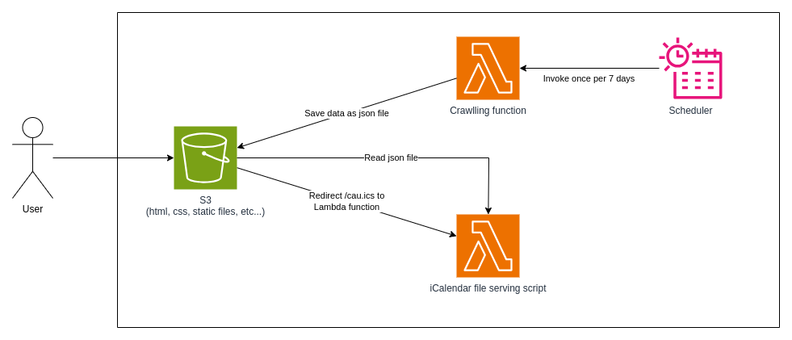
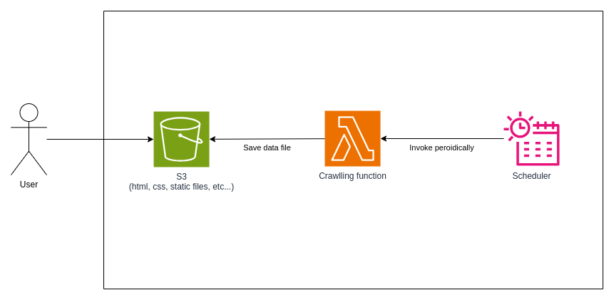

# 서론
학사일정/RSS/시간표 미리보기 서비스의 공통점은 크롤링 서비스이다. 학사일정 서비스의 특정을 요약하면 다음과 같다.
- [학사일정 서비스](https://calendar.puang.network)
    - 주기적으로 학사일정을 크롤링해 데이터베이스에 저장한다.
    - 요청이 들어오면 백엔드에서 데이터베이스 조회결과를 iCalendar 형식으로 변환한다.
        - `from` 매개변수와 `to` 매개변수를 지원해야 하므로 백엔드가 불가피하다. (예시: `/cau.ics?from=2019`)

다른 서비스의 특징은 다음과 같다.
- [강의시간표 미리보기 서비스](https://pre-timetable.puang.network)
    - 주기적으로 강의시간표 데이터를 크롤링해 정적 json 파일로 저장한다.
    - 프론트엔드에서 json 파일을 읽어서 서비스를 제공하다. (즉 크롤링 스크립트 외에는 백엔드가 없다)
- [중앙대학교 RSS 서비스](https://rss.puang.network)
    - 주기적으로 학교 공지사항을 크롤링해 정적 rss/atom/jsonFeed 파일로 저장한다.
    - 프론트엔드는 아무것도 하는 게 없다.

이 글의 시점은 2024년 초이다.

# AWS Lambda를 이용한 서버리스 전환
그렇다면 크롤링 부분만 AWS Lambda 함수로 분리하면 매우 단순한 구조의 서비스이지 않은가?
따라서 다음과 같이 중앙대학교 학사일정 서비스를 재구성했다.

다른 서비스는 백엔드 자체가 필요없으므로 더 단순하다. 강의시간표 미리보기 서비스와 중앙대학교 RSS 서비스의 서버리스 구조도는 다음과 같다.

## 과정
원래 스크린샷 하나하나 찍어가며 상사하게 쓸 생각이었는데 귀찮아진 관계로 대충 글로 정리한다.

1. S3 버킷을 만든다.
1. 정적 호스팅을 활성화한다.
    - 권한을 적절히 설정하여 웹 브라우저로 접속할 때 문제가 없도록 한다.
1. 람다 함수를 만든다.
1. 람다 함수에 권한을 설정한다. (서비스계정 같은 거 만들 필요가 없다. 람다 함수에 권한 부여하면 AWS SDK가 알아서 인식한다.)
1. 리다이렉션이 필요하다면 S3 버킷에 리다이렉션 규칙을 설정한다.
    - 람다 함수로의 리다이렉션이 필요한 거라면 람다 함수에 HTML URL을 만들어서 그 URL로 리다이렉션한다. 더 좋은 방법이 있을 수도 있긴 한데 이 정도로 단순한 서비스에선 대충 이렇게만 해도 충분하다.
1. Scheduler를 만든다.

참 쉽죠?

# 결론
위와 같이 서버리스 서비스를 구축하여 월1000~1500원 정도의 비용으로 서비스를 운영하고 있다.

원래 글을 작년에 쓸 계획이었는데 미루고 미루다보니 1년이 지났다... 이제 글도 썼으니 동아리나 다른 후배에게 서비스를 인수인계할 계획이다.