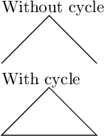

# 들어가는 말
최근 [알고리즘 동아리](https://cauchaos.github.io)에서 주최한 [대회](https://www.acmicpc.net/contest/view/1100)에 운영진으로 참가했다. 대회가 마무리된 후 1,2,3등을 위한 상장을 만들어야 했는데 이때 LaTeX를 써보면 재밌을 것 같다는 생각이 들었다.

따라서 LaTeX을 이용해 아래와 같은 상장을 만들었다.

# TikZ
TikZ는 LaTeX에서 그림을 그릴 때 쓰는 패키지이다. 주로 pgfplots와 함께 사용하거나 그래프를 그릴 때 이용되지만 간단한 그림 정도는 그릴 수 있다.

## current page
TikZ에는 `current page`라는 특별한 노드가 있다. 이 노드는 `current page.south west`나 `current page.west`와 같이 이용되며, 페이지의 모서리를 가리키고 있다.

아래 예시를 보자. TikZ & PGF 메뉴얼 3.1.10버전의 260페이지에 있는 예시이다.
```latex
\begin{tikzpicture}[remember picture, overlay]
    \draw [line width=1mm, opacity=.25]
        (current page.center) circle (3cm);
\end{tikzpicture}
```

위 예시 코드를 빌드하면 페이지의 정중앙에 반지름이 3cm인 원이 그려진다. 위 코드에서 `remember picture`와 `overlay`는 `current page` 노드를 사용하기 위해 필요하다.

## 호 그리기
TikZ는 `\draw arc (시작각도:종료각도:반지름)` 형태의 명령어로 호(arc)도 그릴 수 있다.


## cycle
`cycle`을 이용하면 마지막 노드에서 다시 처음 노드로 이어지는 닫힌 경로를 만들 수 있다.

예시를 보면 이해가 쉽다.

```latex
Without cycle

\begin{tikzpicture}
\draw (0, 0) -- (1, 1) -- (2, 0);
\end{tikzpicture}

With cycle

\begin{tikzpicture}
\draw (0, 0) -- (1, 1) -- (2, 0) -- cycle;
\end{tikzpicture}

```

위 코드를 빌드하면 아래와 같은 결과가 나온다.



# 상장 템플릿 소스코드
본 템플릿에서 그린 상장 테두리 장식은 호와 직선만을 이용해 그릴 수 있는 기하학적인 무늬(문방구 상장용지에서 흔히 볼 수 있는 무늬)이다. 따라서 TikZ를 잘 활용하면 상장 테두리 장식을 그릴 수 있다.

[GitHub Gist](https://gist.github.com/LiteHell/43abe5fcb711676d392d8d1900d5e1e5)에서도 볼 수 있다.

```latex
\documentclass{minimal}
\usepackage{kotex}
\usepackage[svgnames]{xcolor}
\usepackage{tikz}
\usepackage[a4paper, top=100pt, left=80pt, right=80pt, bottom=120pt]{geometry}
\usetikzlibrary{calc}

\newcommand{\thickframemargin}{40pt}
\newcommand{\thickframewidth}{6pt}
\newcommand{\thinframemargin}{46pt}
\newcommand{\thinframewidth}{1pt}
\newcommand{\framecornerradius}{30pt}
\newcommand{\framecolor}{Goldenrod}
\begin{document}
\begin{tikzpicture}[remember picture, overlay]
    % thick corner
    \draw[color=\framecolor, line width=\thickframewidth]
     % north west rounded corner
    ([xshift=\thickframemargin, yshift=-\thickframemargin-2*\framecornerradius] current page.north west) arc (270:450:\framecornerradius)
    -- ([xshift=\thickframemargin, yshift=-\thickframemargin] current page.north west) arc (180:360:\framecornerradius)
     % north east rounded croner
    -- ([xshift=-\thickframemargin-2*\framecornerradius, yshift=-\thickframemargin] current page.north east) arc (180:360:\framecornerradius)
    -- ([xshift=-\thickframemargin, yshift=-\thickframemargin] current page.north east) arc (90:270:\framecornerradius)
     % south east rounded corner
    -- ([xshift=-\thickframemargin, yshift=\thickframemargin+2*\framecornerradius] current page.south east) arc (90:270:\framecornerradius)
    -- ([xshift=-\thickframemargin, yshift=\thickframemargin] current page.south east) arc (0:180:\framecornerradius)
    % south west rounded corner
    -- ([xshift=\thickframemargin+2*\framecornerradius, yshift=\thickframemargin] current page.south west) arc (0:180:\framecornerradius)
    -- ([xshift=\thickframemargin, yshift=\thickframemargin] current page.south west) arc (270:450:\framecornerradius)
    % cycle
    -- cycle;


    % thin corner
    \draw[color=\framecolor, line width=\thinframewidth]
     % north west rounded corner
    ([xshift=\thinframemargin, yshift=-\thinframemargin-2*\framecornerradius] current page.north west) arc (270:360:\framecornerradius)
    -- ([xshift=\thinframemargin+\framecornerradius, yshift=-\thinframemargin-\framecornerradius] current page.north west) arc (270:360:\framecornerradius)
     % north east rounded croner
    -- ([xshift=-\thinframemargin-2*\framecornerradius, yshift=-\thinframemargin] current page.north east) arc (180:270:\framecornerradius)
    -- ([xshift=-\thinframemargin-\framecornerradius, yshift=-\thinframemargin-\framecornerradius] current page.north east) arc (180:270:\framecornerradius)
     % south east rounded corner
    -- ([xshift=-\thinframemargin, yshift=\thinframemargin+2*\framecornerradius] current page.south east) arc (90:180:\framecornerradius)
    -- ([xshift=-\thinframemargin-\framecornerradius, yshift=\thinframemargin+\framecornerradius] current page.south east) arc (90:180:\framecornerradius)
    % south west rounded corner
    -- ([xshift=\thinframemargin+2*\framecornerradius, yshift=\thinframemargin] current page.south west) arc (0:90:\framecornerradius)
    -- ([xshift=\thinframemargin+\framecornerradius, yshift=\thinframemargin+\framecornerradius] current page.south west) arc (0:90:\framecornerradius)
    % cycle
    -- cycle;
\end{tikzpicture}
\fontsize{16pt}{16pt}\selectfont 제 1 호

\vspace{32pt}

\begin{center}
\fontsize{48pt}{48pt}\selectfont
상\hspace{1.25em}장
\end{center}

\vspace{50pt}


\fontsize{20pt}{20pt}\selectfont
최우수상\hspace{\stretch{1}}홍길동


\vspace{80pt}

\begin{center}
 \fontsize{20pt}{30pt}\selectfont
 위 사람은 \LaTeXe를 잘 활용하여 타의 모범이 되었으므로 이 상을 수여합니다.
\end{center}


\vspace{\stretch{1}}

\begin{center}
 \fontsize{20pt}{20pt}\selectfont
 1970년 1월 1일
\end{center}


\vspace{2em}

\begin{center}
 \fontsize{30pt}{30pt}\selectfont
 \LaTeXe{} 애호가 김철수
\end{center}

\end{document}

```

# 사진
