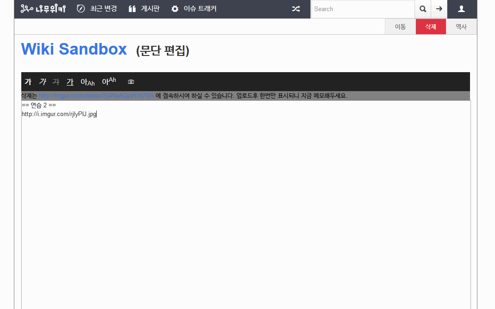

# 들어가며
추억여행을 위해 2015년으로 올라가보자. 2015년에 [나무위키](https://namu.wiki)가 생겼다. 나무위키는 [리그베다위키](https://www.rigvedawiki.net/)와 [엔하위키 미러](web.archive.org/web/20150607151726/https://mirror.enha.kr/wiki/FrontPage)를 무너트리고 급격히 부상했다. 토론과 편집에 있어 전에 비해 크게 향상된 편의성(접근성), 그리고 SEO가 큰 원인이였다.
 
그때의 나무위키는 지금과 많이 달랐다. UI도 달랐고, 이미지 업로드 기능과 에디터도 없었다. 그래서 그때는 이미지를 올릴려면 [imgur](https://imgur.com)에 업로드한 뒤 그 주소를 직접 복사해야 했다. 그래서 '이걸 간단하게 할 수 있지 않을까?'라는 생각이 들었고, 바로 간단한 에디터와 imgur 이미지 업로드 기능을 추가하는 유저스크립트를 배포했다. 그게 바로 [NamuFix](https://github.com/litehell/namufix)의 시작이었다.

(초창기 나무위키에 NamuFix 초기버전을 적용시킨 모습)

이 글에서는 [NamuFix 릴리즈 목록](https://github.com/LiteHell/NamuFix/releases)을 시간대별로 보면서 추억을 회상할 것이다. 글 쓰는데 익숙하지 않아 두서없을 수 있지만, 넓은 아량으로 읽어주기를 바란다.
 

## 업데이트들
2015년 초부터 2020년 초까지 총 5년동안 유지보수했다. 그래서 이 유저스크립트에는 추억이 참 깊다.

### 첫 버전
초반에 잠깐 [GitHub Gist](https://gist.github.com)를 써서 배포하다가 그냥 [GitHub](https://github.com)에 [레포](https://github.com/LiteHell/NamuFix)를 하나 파서 배포했다. 처음에는 버전을 그냥 평범하게 3.14의 형식으로 매기다가 '15년 8월부터 YYMMDD.N(N은 해당 날짜의 몇 번째 업데이트인지를 나타내는 숫자)의 형식을 채택했다. 어렸을 때에는 버전을 자동으로 매기는 방법을 몰랐고, 버전을 직접 매길 때는 이 방법이 편했다.
 
이렇게 YYMMDD.N 형태의 버전으로 배포한 첫 버전은 imgur 업로드 기능 외에도 몇가지 기능이 더 있었다. 임시저장 기능과 지도/TV팟/유튜브 삽입기능, 템플릿 불러오기 기능(귀찮게 복붙하지 말고 바로 불러올 수 있게 하는 기능)이다. 그때는 [위키 갤러리](https://gall.dcinside.com/dcwiki)가 엄청 활성화됐을 때라서, 그 곳에서 기능 건의를 받곤 했었다. GitHub 이슈 트래커는 비개발자들에게 접근성이 낮았기에 이렇게 직접 발품을 파는 방식이 더 좋았다.
 
그 다음에 추가된 기능들은 문서 주시 기능과 리다이렉트를 간단하게 생성하는 기능들이였다. 문서 주시 기능은 문서에 변경 사항이 있으면 알림을 띄워주는 기능이고, 리다이렉트 생성 기능은 그냥 리다이렉트의 도착지 문서에서 클릭 한 번만으로 편하게 만들 수 있게 하는 기능이다. 문서 주시 기능은 초반에 딜레이를 낮게 했더니 서버측에서 차단하는 버그가 있었다. 그래서 급하게 강제로 비활성화해서 배포하고, 해당 버그를 고치고 다시 활성화했다가, 결국에 그냥 삭제해버렸다. 그 밖에도 토론에 아이덴티콘 추가하는 기능이랑, 사용자 기여/토론 통계 기능도 넣었다. 이 모든 것들이 8월까지의 일이었다.
 
### 여시-워마드
그러다가 8~9월쯤에 페미니즘 관련 사태가 터졌다. (시기가 정확하진 않다. 필자는 기억력이 매우 나쁘다.) 그때 나무위키에서는 [archive.is](https://archive.is)로 아카이브를 떠서 넣는 유행이 있었는데, 기여해본 사람은 알겠지만 이게 약간 귀찮다. 주소를 일일이 복사-붙여넣기하기 위해 마우스를 움직이는 것도 귀찮은 것이 사람 마음 아니겠는가. 그래서 9월에 편집기에 아카이브 메뉴를 추가했다. 나무위키내 편집기에서 바로 아카이브를 만들어 링크를 첨부할 수 있는 기능이었다. 그때의 열렬한 반페미니즘 기여자들에게는 정말로 편리했을 것이다.

그 밖에도 나무위키 이슈 트래커에 접속할 시(그때는 있었다. issue.namu.wiki라고...) https로 자동 전환해주는 기능이랑, 리버전 비교를 더 편하게 하는 기능, 편집 불가능한 문서에서 소스코드를 보여주는 기능도 추가했다. 그때는 편집 불가능한 문서에서 편집을 시도하면 소스코드를 보여주지 않고 그냥 오류 메세지만 표시했다. 이 기능이 '15년 9월 10일에 추가된 기능이었는데, 나중에 나무위키측에서도 편집 불가능 문서의 편집을 시도할 시 소스코드를 보여주도록 변경했다. 그래서 '15년 9월 17일에 해당 기능을 제거했다.

### 비트코인 받아요
9월 19일에는 나무위키 기부 버튼을 추가하도록 업데이트했다. 지금은 나무위키가 [umanle s.r.l](https://umanle.net/)의 소유지만, 그때는 [개발자 namu](https://namu.wiki/w/사용자:namu)의 소유였다. 그때 namu가 돈 좀 기부해달라면서 비트코인 주소를 공개한 적이 있었다. 그 주소를 NamuFix를 통해 상단바 메뉴 형식으로 추가한 것이다, 누르면 비트코인 주소가 뜨도록. 이 기능은 추후 9월 28일에 하단 기부 문구형식으로 뜨도록 수정했고, 그 다음 날에 QR코드 이미지를 추가했다. 이 기능은 나중에 나무위키가 umanle s.r.l에서 인수되면서 '16년 9월 11일에 제거했다.

자기 기여 보는 메뉴 추가하는 기능(이하 "내 기여 메뉴 추가 기능")도 '15년 9월에 추가했다. 지금은 편해졌지만, 그때는 자기 기여 보기가 좀 불편했다, 주소에서 IP/아이디 부분을 직접 바꿔서 쳐야했다...

언제인진 기억안나지만 앵커 미리보기 기능도 추가했다. 나무위키 토론에서 토론 스레드 번호(예시: `#3`)를 누르면 해당 스레드로 가는 기능이 있는데, 이게 왔다갔다 하다보면 은근히 헷갈린다. 그래서 그냥 토론 스레드 번호위에 마우스만 올리면 해당 스레드 내용을 띄워주는 기능을 추가했다. 내가 매우 편하게 썼으니, 다른 사람들도 편하게 썼을 것이다.
 
### VPNGate
그 당시 나무위키에는 VPNGate를 이용한 반달이 성행했다. 그래서 VPNGate IP인 게 확인되면 일단 차단하곤 했는데, 그거 편하게 하라는 의미에서 10월 4일에 토론시 VPNGate VPN 여부 확인 기능을 추가했다. 토론할때 어떤 IP이용자가 VPNGate IP면 옆에 뜨는 기능이다. 이 밖에도 편집화면에서 미리보기/비교를 바로 할 수 있도록 편집기를 위키백과와 비슷하게 탭방식으로 수정했고, 코드 강조 기능도 추가했다. 그때는 나무위키에 코드 구문 강조 문법이 없었는데, 나중에 나무위키측에서 자체적으로 지원을 시작했기에 해당 기능은 '16년 9월에 제거됐다.

### 레이아웃 변경
'15년 10월에 나무위키에서 프론트엔드를 변경했다. 초창기에는 [Daum Dough](https://github.com/daumcorp/Dough)를 이용한 검은색 프론트엔드를 썼었는데, 이를 완전히 버리고 [Bootstrap](https://getbootstrap.com)에 기반한 프론트엔드로 완전히 탈바꿈한 것이다. 그래서 10월 10일과 11일에 이에 대응하는 대규모 업데이트를 실시했다. 이때 앞서 말한 내 기여 메뉴 추가 기능도 같이 삭제됐다, 프론트엔드가 바뀌면서 추가됐기 때문이다.

10월 17일에는 imgur에서 나무위키를 차단함에 따라 imgur 업로더 기능을 삭제했다. 나무위키측에서는 급하게 캐시서버를 만들어 대응했다가 추후 자체적으로 이미지 업로드를 지원하는 방식으로 완전히 해결했다.

이 자체 이미지 업로더를 쓰려면 [파일 올리기](https://namu.wiki/Upload) 페이지를 들어가야 한다. 어? 따로 다른 페이지에 들어갈 필요없이 편집페이지에서 바로 이미지를 올릴 수 있으면 더 편하지 않을까? 그래서 NamuFix에서 '16년 3월 19일에 이걸 추가했다. 그리고 토론에서 IP주소 옆에 상세정보 조회 버튼도 만들었다.

#### 토론 주소의 변경
'17년 7월에는 나무위키 토론 주소가 `https://namu.wiki/topic/번호`에서 `https://namu.wiki/thread/번호` 형식으로 변경됐었다. 그래서 이에 대응하는 긴급 업데이트를 진행했다. 그 다음날에는 IP주소 관련 기능의 속도도 개선했다.
이 토론 주소 변경 이후로 많은 토론들이 접근불가가 됐다, 주소 형식의 변경으로 인해 단절됐기 때문이다.

'17년 8월에는 나무위키에서 서버 부하를 줄인다는 이유로 토론에서 보이는 쓰레드만 불러들이도록 업데이트했다. 그래서 가만히 생각해보니 이거 무시하고 한 번에 불러들이는 기능을 추가하면 사람들이 좋아할 것 같았다. 그래서 Namufix에 보여지지 않는 쓰레드도 불러오는 기능을 추가했다.

### 이미지 업로더
10월에는 KISA WHOIS 조회 기능을 추가하고, [A위키](https://awiki.theseed.io)(지금은 알파위키지만 그때는 이름이 없었다.)를 지원하기 시작했으며, 드래그드롭 업로드 기능과 편집기 내 복사-붙여놓기를 통한 이미지 업로드 기능을 추가했다. 드래그드롭 업로드 기능이 확실히 반응이 좋았던 것으로 기억한다. 다른 사람이 NamuFix 이미지 업로드 기능으로 사진을 막 업로드하며 웹툰 문서를 만들다가 차단당하는 사례도 있었다.

그리고 이미지 업로드시 확장자 jpeg이면 jpg로 변경하라고 경고 띄우는 기능도 추가했다. 지금은 고쳐졌을지 모르겠는데, 그때는 나무위키측에 확장자가 jpeg이면 이미지 업로드시 오류가 나는 버그가 있었다. 이유는 오직 namu만이 안다.

### 차단기간 초단위 입력 기능
10월에 차단기간을 초 단위로 입력하는 기능을 추가했다. 그때 나무위키의 차단 UI는 3일, 5일, 1주, 2주 이런 식으로만 선택할 수 있었다. (그래서 나무위키 규정을 보면 1개월을 4주로 계산한다.) 근데 UI가 그런거지 내부적으로는 초 단위까지 지정할 수 있었다. 그래서 이를 이용해 초 단위로 차단 기간을 설정할 수 있게 하는 기능을 추가했다. 처음에는 초 단위의 시간을 입력하게 했는데, 생각해보니 이건 아닌 거 같아서 다음날에 연/월/일/시/분/초를 입력하면 자동으로 초 단위의 시간이 입력되도록 개선했다.

### 기록의 가독성 향상
그때의 나무위키는 [차단기록](https://namu.wiki/BlockHistory)에서 차단 시간을 초 단위로만 표시했다. 초 단위의 시간만 보면 며칠인지 바로 감이 오지 않는다. 그래서 이 초 단위의 시간을 "몇일 몇시간" 이런식으로 좀 보기 편하게 바꾸는 기능을 10월에 추가했다.

문서 역사에서 ACL 변경 기록도 (참고 : 그때의 ACL 시스템이랑 지금의 ACL 시스템은 다르다. 지금은 규칙기반의 ACL 시스템이지만, 그때는 열람/수정/삭제/토론/이동 권한을 `member`, `admin`, `everyone` 셋 중 하나로 설정하고, 추가적으로 국내 열람 가능 여부를 설정하는 방식이였다.) 보기 쉽게 바꾸는 기능도 추가했다. 문서 역사에서 ACL 변경 기록이 `(everyone, everyone, member, everyone, everyone)` 이런식으로 뜨니 뭐가 뭔지 한 번에 알아보기 어려웠다. 그래서 `everyone`은 `모두` 이런식으로 바꾸고 그 옆에 알맞은 아이콘을 추가하는 기능을 구현해 배포했다. 이렇게 하니 내가 보기 좀 편해서 좋았다.

### liberty 스킨
'17년 11월에 나무위키에 [liberty 스킨](https://github.com/namu-theseed/theseed-skin-liberty)이 추가됐다. 그래서 이 스킨을 지원하도록 NamuFix를 수정했다. 그리고 이때쯔음 A위키가 알파위키로 바뀌며 주소도 `https://awiki.theseed.io`에서 `https://www.alphawiki.org`로 바뀌었다. 그래서 알파위키에서도 스크립트가 불려와지도록 업데이트했다.

### Greasmonkey 4, KST
'17년에 [Greasemonekey 4가 나오면서 API가 변경되었다.](https://www.greasespot.net/2017/09/greasemonkey-4-for-script-authors.html) 따라서 이를 지원하기 위해 '17년 12월 초에 GM4를 지원하도록 스크립트를 수정했다. 또한 나무위키 게시판에서 시간대를 KST로 표시하는 기능을 추가했다. 그때 당시 나무위키 게시판은 시간대를 KST가 아닌 UTC로 표시했다. 그래서 시간을 보면 머릿속으로 9시간을 더하는 암산을 해야했는데... 귀찮지 않은가? 그래서 그냥 댓글/게시글 작성일의 시간대를 자동변환하는 기능을 추가했다.

또한 '17 12월에 여러개의 계정이나 IP를 한 번에 차단하는 일괄 차단 기능을 추가했다. 내 기억상으로 나무위키/알파위키 관리자들이 이 기능을 매우 잘 썼던 것으로 기억한다.

여기서 더 나아가, [토론에서의 긴급차단 기능을 문서 역사로 확대하고,](https://github.com/LiteHell/NamuFix/issues/64) [최근 변경 페이지](https://github.com/LiteHell/NamuFix/releases/tag/171224.0)와 [사용자 기여내역](https://github.com/LiteHell/NamuFix/issues/86), [나무위키 게시판](https://github.com/LiteHell/NamuFix/issues/106)에서도 긴급차단을 할 수 있도록 개선했다. 이 긴급차단 기능도 일괄차단 기능과 함께 관리자들이 애용했던 것으로 기억한다.

### INFRA, CUSTOMER, 차단사유, 상용구
KISA WHOIS 조회시 네트워크 구분이 INFRA로 뜨면 공용 IP고 CUSTOMER로 뜨면 공용 IP가 아니라는 것을 아는가? 이는 위키 관리자에게 중요한 상식이다.

근데 이걸 매번 KISA WHOIS 조회페이지에 입력해가면서 확인하면 귀찮다. 그래서 '18년 1월 초에 토론페이지에서 IP 옆에 해당 네트워크 구분을 표시하는 기능을 추가했다. 이때 서버에 요청을 너무 많이하면 안 되니까, 내부적으로 캐시를 만들어 중복되는 요청은 하지 않도록 했다.

나무위키는 차단사유에 링크를 넣으면 사용자문서에서 그냥 텍스트로만 넣어준다. 즉, 눌러도 링크 안 열린다. 이건 지금도 그런데, 크리티컬하진 않지만 소소하게 번거롭다. 그래서 차단사유에 웹페이지 주소가 있으면 해당 주소로 가는 링크를 생성하는 기능을 1월 말에 추가했다. 몇몇 사람들에겐 약간 유용했을 것이다.

'18년 2월에는 [ID 기여자의 기여목록에서 차단내역을 조회하는 기능을 추가했다.](https://github.com/LiteHell/NamuFix/issues/75) 하긴, 직접 ID 복사해서 차단내역 검색하는 건 은근히 귀찮다. 나무위키 게시판을 자세히 보면 관리자들이 똑같은 댓글을 자주 다는 것(예시: "기각합니다")을 볼 수 있는데 이를 캐치하여 [나무위키 게시판 댓글 사용구 기능도 추가했다.](https://github.com/LiteHell/NamuFix/commit/e8cc6bea9d514f3e96a33e7dc204e45e162cf604)

### SSL은 이제 상식이죠
나무위키는 초창기부터 `no-ssl.namu.wiki`로 SSL없이 접속할 수 있었다. 이 기능이 어느순간 삭제돼서 '18년 5월에 해당 주소에서의 NamuFix 지원을 삭제했다.

'18년 10월에 알파위키가 잠시 폐쇄됐었다. 그래서 '18년 10월 말에 알파위키 지원을 삭제했다. 그리고 '19년 1월 초에 클릭 한 번으로 바로 되돌릴 수 있는 빠른 되돌리기 기능을 추가했다.

'19년 1월 20일에는 IP Quality Score를 추가해달라는 요청도 있어서 KISA WHOIS 조회기능 사용시 IP Quality Score도 같이 표시되도록 개선했다. 근데 이게 그렇게 도움이 될 지는 잘 모르겠다.

'19년 6월 말에는 일괄 블라인드 기능을 추가했고, 그리고 이것저것 자잘한 것들을 추가했다.

## 지원중단
2019년 9월쯤에 나무위키가 기존의 [Swig](https://github.com/paularmstrong/swig) 라이브러리를 던지고 Vue를 쓰기 시작했다. 이때를 기점으로 NamuFix에 매우 많은 버그가 생기기 시작했고, 버그를 고치기 어려워서 이때를 기점으로 지원을 중단했다. 그러나 지원을 중단했음에도 불구하고 [Vue 업데이트를 일정 부분 되돌리는 유저스크립트](https://github.com/gdl-blue/classic-theseed)를 만들어서 어떻게든 NamuFix를 쓰는 사용자분들이 있었다. 이걸 보면서 감회가 꽤 새로웠다.

## 얼마나 썼을까?
유저스크립트에 애널리틱스같은 걸 넣지 않아서, 얼마나 많은 사람들이 썼는지는 정확히 가늠할 수 없다. 하지만 적지 않은 사람들이 이 스크립트를 써주고 이슈와 PR을 올려줬다는 점 만큼은 기억하고 있다. 특히 관리자들이 이 스크립트를 써줬다는 것이 인상적이었다. [특히 일반 관리자가 아닌 사측 관리자도 쓰는 점은 더 놀라웠다.](https://board.namu.wiki/b/report/773522)

## 디테일의 UX, 그리고 추억
이 유저스크립트는 "디테일의 불편함"을 개선하고 수정하는 데 중점을 뒀다. 사람들은 사소한 부분에서도 불편함을 느끼고, 사소한 부분에서도 편리함을 느낀다. 이 유저스크립트를 만들면서 한가지 교훈을 얻었다: UX는 디테일부터 시작한다는 것이다.

이 스크립트는 곧 내 추억이다. 내가 만든 프로그램들 중 많은 사람들이 써준 첫 프로그램이었다. 이 스크립트를 만들면서 리그베다위키가 망하는 것을 보았고, 나무위키가 생기는 것을 보았고, 나무위키 관리자들이 선거로 뽑히는 것을 보았고, 나무위키에서 기존 리그베다식 표현이 삭제되는 것을 보았고, 나무위키가 umanle s.r.l로 인수되는 것을 보았다. 그러한 역사를 NamuFix를 유지보수하며 묵묵히 지켜봤다. 시험공부를 하다가도 NamuFix 개발이 너무 재밌어서 바로 버그를 수정하던 그 시절이 그립다.

UX는 디테일에서부터 시작한다. 관찰과 소통으로 디테일의 불편함을 찾아내고 개선할 수 있었다.