# 들어가는 말
얼떨결에 동아리에서 자리를 하나 맡게 되면서 사이트를 인수인계받았다. [오픈나무](https://github.com/2du/openNAMU)을 약간 수정해서 자체적으로 운영하던 사이트였는데, 회원들의 사적인 정보가 담겨있었다. 이걸 그냥 개방된 채로 뒀다가 사고가 나면 어떻게 될 지 상상하고 싶지 않더라.
그래서 사이트를 운영하기에 앞서 다음과 같이 수정해야할 필요가 있었다.
- 위키를 외부인에게 공개해선 안 됐다.
- 누구나 위키에 가입해선 안 됐다.
- 학교 학생임을 증명해야 했다.

# 오픈나무 수정
첫번째 목표는 오픈나무에서 제공하는 ACL기능을 이용해서 달성할 수 있다. (ACL 기능을 [도구로까지 확장하면](https://github.com/2du/openNAMU/pull/923) 더 완벽히 틀어막을 수 있다.)
다만 두번째 목표부터는 쉽지 않았다. 두번째 목표를 달성하려면 회원가입을 위키 소유자가 통제할 수 있는 기능이 필요했는데, 오픈나무에는 그런 기능이 없었다. 그래서 직접 [회원가입 승인 기능](https://github.com/2du/openNAMU/pull/819)을 추가했다. 세번째 목표는 이메일 인증을 강제하고 도메인을 제한하는 방향으로 접근했다. 이걸 하려면 오픈나무에서 제공하는 이메일 화이트리스트 기능을 쓰면 되는데, 사소한 문제가 있었다. 오픈나무가 네이버, G메일, 다음, 카카오 메일을 강제로 자동추가한다는 점이다. (하드코딩이라 삭제도 안 된다.) 그래서 [약간의 수정](https://github.com/2du/openNAMU/pull/821)으로 이 문제를 해결했다. 또한 이메일 발송시에 구글을 안 쓰는데 메일 발송 설정에서 구글만을 지원해서 이것도 [수정](https://github.com/2du/openNAMU/pull/842)했다.

## 게시판을 만들까?
그렇게 위키를 수정해서 굴리고 있었는데 문득 게시판이 있으면 좋겠다는 생각이 들었다.
근데 귀찮다고 XE만 깔고 통치면 위키랑 XE가 아이디가 따로 놀잖아.

이거는 보기가 별로 예쁘지 않다. 그래서 통합 로그인을 구축하기로 했다.

### 접근방식
로그인을 통합하기 위해서는, 아이디와 비밀번호 등 인증 정보를 관리하는 서비스가 필요했다. 이 문단에서는 이를 `통합 로그인 제공자`라고 통칭한다.

위키밖에 없는 상황이니, 통합 로그인 제공자가 있을리 없었다. 이런 때에는 두가지 방법으로 접근할 수 있다.
- 위키가 통합 로그인을 제공하도록 하고, 게시판이 위키를 통해 로그인하도록 하기
- 통합 로그인을 제공하는 사이트를 만들고, 위키와 게시판이 통합 로그인 제공자를 통해 로그인하도록 하기

각자 장단점이 있다. 위키에서 통합 로그인을 제공하도록 하는 첫번째 방법은 아래와 같은 장점이 있다.
- 장점
    - 기존에 있던 위키 이용자들의 인증 정보를 별다른 마이그레이션없이 그대로 쓸 수 있다.
    - 기존에 있던 위키 소스코드를 수정하기만 하면 된다.
- 단점
    - 위키 소스코드를 수정하는 과정이 굉장히 짜증날 것 같다.

두번째 방법의 장단점은 다음과 같다.
- 장점
    - 개발하면서 공부를 더 많이 할 수 있다.
    - 위키와 함께 합쳐두는 것보다는 따로따로 두는 것이 왠지 보기 깔끔할 것 같다.
- 단점
    - 기존 위키의 인증 정보를 새로운 통합 로그인 제공자로 옮겨야 한다.
    - 오픈나무도 통합 인증을 지원하도록 수정해야 했다.

나는 두번째 방법을 택했다. 그 이유로는 위키를 수정하는 과정이 번거로울 것 같아 차라리 새로 개발하는 게 더 좋을 것 같았고, 그 과정 속에서 공부가 더 많이 될 것 같았다. 인증 통합에 이용할 표준으로는 [OpenID Connect Core 1.0](https://openid.net/specs/openid-connect-core-1_0.html)을 채택했는데, SAML2.0같은 다른 표준들은 복잡해 보였기 때문이다. (일단 SAML2.0은 XML을 써서 귀찮지만 OpenID Connect Core 1.0은 OAuth2.0 기반이고 JSON을 쓴다.)

## 프로토타이핑
두번째 방법을 택한 나는 일단 최단기간 안에 개발하기 위해 내게 익숙했던 언어와 프레임워크를 택했다. [TypeScript](https://www.typescriptlang.org/) 언어와 [koajs](https://github.com/koajs/koa) 프레임워크를 이용하고, 템플릿 엔진으로 [pugjs](https://github.com/koajs/koa) 라이브러리를 이용했다. OpenID Connect Core 1.0 개발은 [oidc-provider](https://github.com/panva/node-oidc-provider) 라이브러리를 이용했다.

근데 빠르게 개발한 것이라 그런가 문제가 있었다. 먼저 소스코드가 좀 많이 더러웠고, oidc-provider 라이브러리가 생각 이상으로 무거웠다. oidc-provider가 생성하는 세션과 홈페이지 자체적인 세션이 따로따로 노는 것도 약간 마음에 안 들었다.

그래도 일단 사이트를 만들긴 했으니 만든 사이트를 사용하고, 나중에 기회가 되면 사이트를 제대로 다시 만들기로 마음먹었다.

## 리빌딩
2020년 연말에 여유가 남아 사이트 재개발을 하기 시작했다. TypeScript를 이용하되 지난 번과 달리 프론트엔드랑 백엔드를 분리하기로 마음먹었다. 프로토타이핑때 백엔드랑 프론트엔드를 합친 "전통적인 방식"으로 개발했더니 소스코드가 영 보기 좀 그랬다.

그러려면 프론트엔드랑 백엔드 사이에 통신하는 API 스펙이 필요하다. 단순하게는 JSON 기반의 REST API를 이용하는 방법이 있다. 근데 이런 방식은 경험상 개발하다가도 스스로 API 스펙을 헷갈리기 쉽고, 문서화하기가 굉장히 귀찮았다.

그래서 어떻게 할까 생각하는데 문득 [2020 오픈소스 컨트리뷰톤](https://www.oss.kr/notice/show/18f215a2-a650-4c46-aaab-b4cf7d41484e?page=2)에서 참가했던 [HackaTalk](https://github.com/dooboolab/hackatalk) 프로젝트가 떠올랐다. HackaTalk의 서버 기술스택은 [Prisma](https://www.prisma.io)-[GraphQL Nexus](https://nexusjs.org/)로 이루어진 [GraphQL](https://graphql.org/) 기반의 기술스택이다. Prisma는 GraphQL 개발시에 쓰면 편한 ORM이고, GraphQL Nexus는 GraphQL Schema를 작성할 때 쓰는 Code-First 철학의 라이브러리이다. GraphQL Nexus를 쓰면 Nexus에서 TypeScript Type Definition 파일을 자동으로 생성해줘 코딩할 때 인텔리센스와 TypeScript 컴파일러의 도움을 받을 수 있다.

이런 기술스택을 쓰면 괜찮겠다는 생각이 들어서, 백엔드는 Prisma와 GraphQL Nexus 기반에 [GraphQL Yoga](https://github.com/prisma-labs/graphql-yoga)를 이용해 만들기로 했다. 프론트엔드는 [Nuxt.js](https://ko.nuxtjs.org/)를 이용하고, GraphQL 요청은 [@nuxtjs/apollo](https://www.npmjs.com/package/@nuxtjs/apollo)를 이용했다.

또한 이번 개발때는 oidc-provider와 같은 라이브러리를 이용하지 않고 OAuth2와 OpenID Connect Core 부분을 직접 개발하기로 마음먹었다.

### OAuth2?
[OAuth2 (RFC6749)](https://tools.ietf.org/html/rfc6749)란 리소스 소유자(주로 사용자)와 리소스 서버(주로 API 제공자), 리소스를 이용하고자 하는 HTTP 서비스(이하 클라이언트, 주로 서드파티) 간의 상호작용을 정의한 표준이다. 정보통신표준화위원회 [RFC6749 번역본](http://committee.tta.or.kr/data/standard_view.jsp?order=t.standard_no&by=asc&pk_num=TTAE.IF-RFC6749&commit_code=PG504)의 한글 내용요약을 인용하면 다음과 같다.

> 공개 인증 2.0 프레임워크는 리소스 소유자를 대신하여 리소스 소유자와 HTTP 서비스간에 승인된 상호작용에 의하거나 또는 그 자신을 대신하여 얻은 접근권한을 제삼의 응용에게 제삼의 응용에게 허여하여, HTTP 서비스에 대한 제한적 접근을 획득하도록 제공을 한다. 본 표준은 공개 인증 1.0에 기술된 프로토콜을 대신한다.
>
> -- 출처 : [TTAE.IF-RFC6749](http://committee.tta.or.kr/data/standard_view.jsp?order=t.standard_no&by=asc&pk_num=TTAE.IF-RFC6749&commit_code=PG504)

OAuth2는 거의 모든 웹 서비스에서 API 인증 방식으로 쓰이는 범용적인 표준이다. OAuth2가 없을 적에는 클아이너트가 리소스 소유자(주로 사용자)의 접근이 제한된 리소스(예시를 들자면 이메일 주소 같은 것들)에 지속적으로 접근하려면 리소스 소유자의 자격증명(credentials, 주로 비밀번호)을 바람직하지 않은 방법(예시: 평문)으로 저장해야 하는 문제점이 있었다. 또한 클라이언트가 비밀번호를 평문으로 저장하는 경우, 추후 접근 허가를 철회하거나 서드파티를 통제하기도 어렵다는 문제점도 있었다.

OAuth2는 이러한 문제점을 해결하기 위해 `Access Token(엑세스 토큰)`이란 개념을 도입한다. 액세스 토큰은 클라이언트가 접근이 제한된 리소스를 취득하기 위해 사용하는 자격증명으로, 토큰 그 자체로는 어떠한 의미도 지니지 않는다. 이 액세스 토큰은 OAuth2에서 정의하는 여러가지 방식에 따라 취득할 수 있는데, 리소스 소유자가 인증을 담당하는 Authorization 서버(혹은 리소스 서버, Authorization 서버와 리소스 서버는 동일할 수 있다.)에 직접 인증하는 방식이 거의 대부분이기에 서드파티에 자격증명을 줄 필요가 없다는 장점이 있다.

#### Authorization Code Grant
`Authorization Code Grant`는 클라이언트가 Access Token을 얻기 위한 방법 중 하나이다. 아래 그림은 RFC6749 Section 4.1의 Figure 3을 한국어로 옮긴 그림이다.

그림의 설명하자면 다음과 같다. 먼저 클라이언트가 User-Agent(웹브라우저)를 클라이언트 식별자와 리다이렉션 주소가 담긴 Authorization Request 주소로 리다이렉트시키면(그림에서 (A) 단계), Authorization 서버에서는 사용자에게 인증을 요구한다(그림에서 (B) 단계). 사용자가 인증을 완료하면 Authorization 서버는 리다이렉트 주소에 Authorization Code를 `code` 매개변수로 추가해 User-Agent를 그 주소로 리다이렉트시킨다. (그림에서 (C) 단계) 그러면 클라이언트는 `code` 매개변수로 Authorization Code를 얻게 되고, 이 코드를 Authorization 서버에 보내 엑세스 토큰과 교환할 것을 요청한다. (그림에서 (D) 단계) 그러면 Authorization 서버는 Authorization Code를 확인하고 그 코드가 올바르다면 액세스 토큰을 발급해 클라이언트에게 제공하게 된다. (그림에서 (E) 단계)

쉽게 말해, Authorization 서버가 사용자를 확인하면, Authorziation 서버는 클라이언트에게 Authorization Code를 주고, 클라이언트는 그 Authorization Code를 엑세스 토큰과 교환하는 방식이다.

Authorization Code Grant는, 코드를 주지 않고 바로 엑세스 토큰을 주는 Implicit Grant와 달리, 리소스 소유자에게 엑세스 토큰을 노출하지 않는다는 장점이 있다. 다만 Authorization Code Grant는 클라이언트 인증이 요구되므로 JavaScript 등으로 클라이언트 사이드에서 작동하는 웹 어플리케이션보다는 서버(백엔드)가 있는 웹 사이트에 적합하다.

#### OAuth2 인증의 구현
OAuth2 인증을 구현하기 위해 백엔드단에서 GraphQL 서버말고 HTTP 서버도 열어야 할 필요가 있다. 따라서 HTTP 서버를 열고 GraphQL 서버와 다른 포트에서 요청을 받도록 수정했다. (어처피 리버스 프록시 쓰면 포트 달라도 서비스하는 데엔 상관없다.)

OAuth2 인증을 구현하려면, 외적으로는 인증을 하는 Endpoint와(이하 `인증 Endpoint`, 보통 `/authorize`와 같은 이름으로 구현함) 토큰을 교환하거나 발급하는 Endpoint(`/token`과 같은 이름을 구현함.) 두가지를 구현해야 한다.

그런데 앞서 말했듯 프론트엔드와 백엔드가 분리되어 있다. 그러니 당연히 사용자의 인증정보(세션)도 프론트엔드단에서 관리하고 있으므로, 백엔드에서 프론트엔드를 거치고 않고 직접 받는 HTTP 서비스에서는 프론트엔드의 인증 정보를 바로 편하게 받을 수 없었다. (물론 가능은 하겠지만... '굳이?'라는 생각이 들었다. 그리고 그렇게 하면 코드가 생각보다 복잡해질 것 같았다.)
그래서, oidc-provider 라이브러리가 `/interaction/[Some ID Here]`와 같이 리다이렉트하던 것에서 힌트를 받아 다음과 같이 구현했다.
1. 인증 Endpoint에 요청이 들어오면
1. 요청받은 내용을 전부 DB에 저장하고 그 DB 데이터의 Primary ID를 받아서
1. 프론트엔드가 담당하는 페이지로 ID와 같이 전송한다. (예시 : `/authorize_oauth2/[Some ID Here]`)
1. 그러면 프론트엔드에서 GraphQL 서버로의 요청을 통해 인증 요청을 처리한다.

즉, HTTP API 서버의 인증 Endpoint는 요청받은 매개변수를 DB에 저장해 프론트엔드로 넘기는 역할만 하고, 실질적인 인증 처리는 프론트엔드와 GraphQL 서버단에서 이루어지도록 하는 것이다. 이렇게 함으로써 인증 Endpoint와 관련된 문제를 간단히 해결했다.

### OpenID Connect
이제 OpenID Connect를 구현해야 한다. OpenID Connect는 OAuth2 프로토콜 위에서 동작하는 표준으로, 사용자에 대한 간단한 정보를 얻고 사용자를 인증할 수 있도록 하는 간단한 레이어 표준이다. `openid` scope를 포함한 OAuth2 Authorization Request를 보냄으로써 시작하며, [JSON Web Token](http://tools.ietf.org/html/draft-ietf-oauth-json-web-token) 표준을 이용해 사용자를 인증해주는 ID Token을 발급한다.

쉽게 말하면, 내가 Authorization Request를 보낼때 scope에 `openid`도 포함시키면, 서버에서 액세스 토큰 줄때 ID 토큰도 같이 주고, 이 액세스 토큰과 함께 `userinfo` Endpoint(후술)에 접근하면 사용자에 관한 정보(닉네임이라던지)도 주는 것에 관한 표준이라는 것이다.

OpenID Connect를 사용하는 목적과 범위을 통합 인증으로만 극한한다면, [OpenID Connect Core](https://openid.net/specs/openid-connect-core-1_0.html) 표준의 일부분([Section 3.1](https://openid.net/specs/openid-connect-core-1_0.html#CodeFlowAuth), [Section 5.3](https://openid.net/specs/openid-connect-core-1_0.html#UserInfo), [Section 9](https://openid.net/specs/openid-connect-core-1_0.html#ClientAuthentication), 갱신 토큰도 지원한다면 [Section 12](https://openid.net/specs/openid-connect-core-1_0.html#RefreshTokens)도)과 [OpenID Connect RP-Initiated Logout 1.0 - draft 01](https://openid.net/specs/openid-connect-rpinitiated-1_0.html)만 구현해도 실사용에는 크게 무리가 없다. [OpenID Connect Discovery](https://openid.net/specs/openid-connect-discovery-1_0.html)에서 [Section 4 (Obtaining OpenID Provider Configuration Information)](https://openid.net/specs/openid-connect-discovery-1_0.html#ProviderConfig)도 구현하면 서드파티에서 통합 인증을 설정할 때 편하다. [OpenID Connect Dynamic Discovery](https://openid.net/specs/openid-connect-registration-1_0.html)는 전체적인 서비스 운영을 폐쇄적으로 할 생각이라면 굳이 구현할 필요가 없다.

OpenID Connect Core는 다음과 같이 기존 OAuth2 구현을 확장하고 추가적인 `userinfo` Endpoint와 jwks를 제공하는 Endpoint를 만들어 구현할 수 있다.
1. Authorization request 처리시 OpenID Connect Core 스펙에서 정의하는 prompt 매개변수, id_token_hint 매개변수, login_hint 매개변수를 처리하도록 확장한다.
    - prompt 매개변수는 간단하게 prompt=none인데 인증이 안 된 경우라면 무조건 `login_required` 오류를 반환하도록 구현하면 된다.
    - id_token_hint나 login_hint는 id_token_hint와 login_hint에서 가리키는 사용자와 현재 로그인된 사용자가 다르다면 오류를 반환하도록 구현하면 된다.
    - state가 있다면 리다이렉트할 때 쿼리 매개변수로 state를 넣어 리다이렉트한다.
1. 토큰 Endpoint에서 엑세스 토큰을 발급할때 `openid` scope가 포함됐다면 ID 토큰도 함께 발급한다.
    - ID Token 발급시에는 특별한 경우가 아니라면 RS256 알고리즘으로 서명해야 한다. ([OpenID Connect Core 1.0 Section 3.1.3.7. ID Token Validation 문단](https://openid.net/specs/openid-connect-core-1_0.html#IDTokenValidation)에서 `default of RS256`라는 표현으로 명시하고 있음.)
    - nonce가 있다면 id_token 발급할 때 nonce를 포함한다.
    - state가 있다면 리다이렉트할때 쿼리 매개변수로 state를 넣어 리다이렉트한다.
1. `userinfo` endpoint는 액세스 토큰의 scope에 따라 적절한 claim(`name`이나 `nickname` 같은 것들)들을 JSON 객체로 반환하도록 구현한다.
1. jwks를 반환하는 endpoint는 말 그대로 ID Token 발급시 사용하는 jwks의 공개키들을 jwks 형식으로 반환하도록 구현한다.

RP-Initiated Logout도 구현하기로 했다면, 다음과 같은 행동을 하는 HTTP Endpoint를 하나 더 구현해야 된다.
1. id_token_hint 있으면 검증하고
1. 사용자를 로그아웃시킨 뒤
1. id_token_hint와 post_logout_redirect_uri가 **동시에** 주어졌다면 post_logout_redirect_uri가 허가된 주소인지 검증하고, 만약 그렇다면 post_logout_redirect_uri로 리다이렉트한다.
    - **동시에**가 중요하다. id_token_hint없이 post_logout_redirect_uri가 주어졌다면 무효한 요청이다.
    - 요청 매개변수로 state가 주어졌다면 state도 같이 쿼리 매개변수로 붙어서 리다이렉트한다.

RP-Initiated Logout 표준은 OP에서 로그아웃하는 것에 대한 표준이므로, 다른 RP들에 관해서는 언급하고 있지 않다. OP에서 로그아웃할 때 다른 RP들도 로그아웃하는 것을 원한다면 [OpenID Connect Session Management 1.0](https://openid.net/specs/openid-connect-session-1_0.html)이나 [OpenID Connect Back-Channel Logout](https://openid.net/specs/openid-connect-backchannel-1_0.html), [OpenID Connect Front-Channel Logout](https://openid.net/specs/openid-connect-frontchannel-1_0.html)등의 Draft들 중 마음에 드는 것을 골라 구현하거나, 아니면 직접 자신의 방법으로 구현해야 한다.

추가적으로, OpenID Connect Discovery 표준도 구현하기로 했다면, 그냥 적절한 OpenID Provider Configuration Information을 반환하는 `/.well-known/openid-configuration` HTTP Endpoint를 구현하면 된다. 시간이 남으면 표준에서 제시하는 Webfinger 관련 API도 구현해도 되지만, 사이트 관리를 폐쇄적으로 할 계획이라면 굳이 그럴 필요가 없다.

## 구현 끝
위와 같이 구현하면 간단한 SSO 기능을 제공하는 사이트를 만들 수 있다. 이렇게 SSO를 제공하는 사이트에 회원관리 기능과 가입신청 받는 기능도 덧붙여서 간단한 동아리 회원관리 사이트를 만들었다.

Nextjs로 SPA를 구현해서 그런가 깔끔하더라. 수정해야 할 게 지금도 좀 있긴 하지만 예전보단 보기 좋아졌다.

## 그래서 게시판은?
게을려서 아직 안 만들었다. 언젠가 만들지 않을까?
...농담이고, 사실 만들려고 했다가 '단체채팅방이 있는데 굳이 만들어야 할까?'라는 생각이 들어 만들지 않았다. 그래도 이 홈페이지를 개발하면서 많은 도움이 됐다.

끝