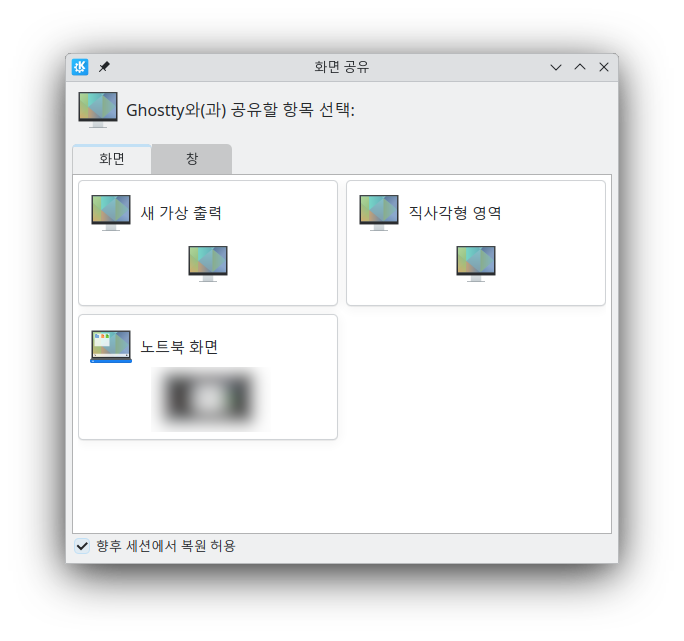

# 들어가는 글
일본어를 모르면서 일본 게임을 하려면 번역기를 써야한다. 요즘 번역기가 잘 되어 있긴 한데 너무 불편하다. 이런 사람들을 위한 게임 번역 프로그램이 있다. 대표적으로 윈도우에서는 [Mort](https://blog.naver.com/killkimno/223907695562)나 [아네모네](https://github.com/sokcuri/anemone)+후커 조합이 있다. 근데 리눅스에는 비슷한 게 없다.

없으면... 만들면 되잖아? 그래서 만들어 보았다.

# 구상
구상은 다음과 같다.

1. 특정 영역이나 창을 선택한다.
1. 다음을 무한 반복한다.
   1. 스크린샷을 찍는다.
   1. OCR을 돌린다.
   1. 텍스트를 번역한다.
   1. 번역된 텍스트를 표시한다.

Mort랑 똑같다. 이제 어떻게 만들지가 문제다.

## 첫번째 구상: KWin과의 강결합
필자는 [KDE Plasma](https://kde.org/plasma-desktop/)를 쓴다. KDE에서는 스크린샷 프로그램으로 [Spectacle](https://invent.kde.org/plasma/spectacle)을 제공한다. 어처피 개인적으로 쓰려고 만든거니 KDE에서만 돌아가도 상관없다. 그러면 해당 Spectacle 소스코드를 잘 살펴보면 되지 않을까? 이때 이름은 **K**DE + B**abelfish**라는 의미에서 **Kabelfish**라는 이름을 점찍어 두고 있었다.

Spectacle 소스코드를 살펴본 결과 Spectacle과 KWin 사이에서는 DBus를 이용하여 통신하는 것으로 보인다. 여기까진 예상했다. 근데 DBus로 통신할 때 [Qt](https://www.qt.io/)에서 제공하는 자료형을 쓴다. 이건 예상 못했는데?

어처피 [Rust](https://www.rust-lang.org/)(필자는 힙스터 기질이 있다)와 Qt 바인딩을 써서 [Kirigami](https://develop.kde.org/frameworks/kirigami//) 기반으로 만들 생각이긴 했으나... DBus 통신할 때 Qt D-Bus 묘듈을 이용해서 Qt 자료형을 쓰면 개발이 과연 쉬울까? Rust-Qt 바인딩을 써본 적이 없어서 확신이 없었다. (바인딩 퀼리티가 꽝이면 개발 과정이 썩 즐겁지가 않다. 아시다시피 Rust라는 언어 자체가 까탈스럽다보니...) 그렇다고 C++ + Qt로 개발하자니 이건 아닌 것 같고... 그래서 고민하다가 다른 분께 의견을 요청했다.

## 두번째 구상: Pipewire
[깻잎](https://keyoxide.org/00120513451AAC4DEFE2832711AB9E784263E186)님께서 Pipewire를 써보라는 제안을 하셨다. [Wayland](https://wayland.freedesktop.org/) 기반 리눅스 DE에서 화면을 녹화하는 표준적인 방법이라고 하셨다. 생각해보니 나쁘지 않은 것 같아 채택하였다.

### Pipewire
Pipewire는 리눅스에서 오디오/비디오 스트림을 핸들링하기 위한 로우레벨 프레임워크이다. Rust에서 pipewire를 이용하기 위해서는 Rust에서는 [pipewire](https://pipewire.pages.freedesktop.org/pipewire-rs/pipewire/index.html) carte를 이용하면 된다. 게임 번역기를 만드는 게 목적이니 오디오 스트림은 다루지 않는다.

#### 과정
Pipewire의 비디오 스트림 핸들링 과정을 진짜 간략히 요약하면 다음과 같다.

1. 메인 루프랑 이것저것을 생성한다.
1. 메인 루프에 핸들러 함수를 설정한다.
1. 루프를 실행한다. (Blocking)

```rust
    let mainloop = MainLoop::new(None)?;
    let context = Context::new(&mainloop)?;
    let core = context.connect(None)?;
    let registry = core.get_registry()?;

    // Do something here....

    mainloop.run(); 
    // 위 코드에서 Blocking이 일어나기 때문에
    // 아래 코드는 실행되지 않는다.
    println!("This code will not be reached");
```

고전적이다. Pipewire 루프는 Blocking이기 때문에 해당 루프는 별도의 스레드에서 구동한다. 잠깐, 근데 별도의 스레드에서 구동되면 Pipewire 루프는 어떻게 중단하지?

pipewire-rs에서는 이를 위해 [pipewire::channel](https://pipewire.pages.freedesktop.org/pipewire-rs/pipewire/channel/index.html) 모듈을 제공한다. 해당 모듈을 이용하면 [Rust mpsc](https://doc.rust-lang.org/std/sync/mpsc/)와 유사한 방법으로 Pipewire 메인루프와 외부 스레드 간에 통신할 수 있다. 이걸 이용하여 외부 스레드로부터 메세지가 수신되면 메인루프를 종료하는 식으로 pipewire 루프를 중단할 수 있다.


```rust
    let mainloop = MainLoop::new(None)?;
    let context = Context::new(&mainloop)?;
    let core = context.connect(None)?;
    let registry = core.get_registry()?;

    // pw_sender는 pipewire가 실행되는 스레드 외부에서 이용된다.
    let (pw_sender, pw_receiver) = pipewire::channel::channel();

    // Do something here....
    
    // pipewire가 실행되는 스레드 외부에서 pw_sender를 이용해 메세지를 전송하면
    // 아래 코드에 의해 메인 루프가 중단된다.
    let _receiver = pw_receiver.attach(mainloop.loop_(), {
        let mainloop = mainloop.clone();
        move |_| mainloop.quit()
    });

    mainloop.run(); 
```

pipewire를 이용해 비디오 스트림을 다루는 방법은 [pipewire-rs 예제코드](https://docs.rs/crate/pipewire/latest/source/examples/streams.rs)와 [관련 pipewire 공식 튜토리얼](https://docs.pipewire.org/page_tutorial5.html)을 참고하자.

### XDG Desktop Portal
Pipewire를 이용하여 비디오 스트림을 다룰 수 있다는 걸 알았다. 그러면 그 비디오 스트림은 이제 어떻게 구할 수 있을까? [XDG Desktop Portal의 Screencast](https://flatpak.github.io/xdg-desktop-portal/docs/doc-org.freedesktop.portal.ScreenCast.html)을 이용하면 된다.



Screencast를 쓰면 위와 같은 창이 뜬다. 리눅스에서 [OBS Studio](https://obsproject.com/)를 써봤다면 익숙할 수도 있다.

Screencast는 D-Bus를 쓴다. 따라서 D-Bus를 이용하여 통신해야 하는데, 찾아보니 [다른 사람이 만들어둔 crate](https://crates.io/crates/portal-screencast)가 있었다. 그래서 그냥 그거 썼다. 편하게 살자.

```rust
    let screen_cast = portal_screencast::ScreenCast::new()
        .expect("Failed to initialize xdg-portal-screencast session");
    let selected = screen_cast.start(None).expect("Failed to select share");
    selected // stream에 pipewire node id가 있다. 이를 이용하여 pipewire로 핸들링하면 된다. 
```

# 최종 구상
따라서 전체적인 구상은 다음과 같다.
1. XDG Desktop Portal로 특정 영역이나 창을 선택한다.
1. 다음을 무한 반복한다.
   1. 비디오 프레임을 이미지로 저장한다.
   1. OCR을 돌린다.
   1. 텍스트를 번역한다.
   1. 번역된 텍스트를 표시한다.

위를 좀 더 구체적으로 적으면 다음과 같다.
1. XDG Desktop Portal로 특정 영역이나 창을 선택한다.
1. 다음을 무한 반복한다.
   1. 비디오 프레임을 이미지로 저장한다.
   1. OCR을 돌린다.
   1. 텍스트를 번역한다.
   1. 번역된 텍스트를 표시한다.

Pipewire 관련 struct는 [Drop trait](https://doc.rust-lang.org/std/ops/trait.Drop.html)를 구현했다. 이러면 Pipewire 메인 루프 중단을 편하게 구현할 수 있다.

## OCR과 번역
OCR은 [Tessearact](https://github.com/tesseract-ocr/tesseract)를 쓰고 번역은 [DeepL API](https://www.deepl.com)를 썼다. 원래는 [LibreTranslate](https://libretranslate.com/)를 쓰려고 했는데 이거 한일번역 성능이 너무 안 좋아서 안 썼다.

GUI는 Qt쓸지 GTK쓸지 계속 고민하다가 [Tauri](https://tauri.app/)를 썼다. 간단하게 써서 그런가 좋긴 좋았다.

# 결론


되긴 되는데 좀 불편하다. 시간날 때마다 고쳐야지...

[소스 코드는 GitHub에서 볼 수 있다.](https://github.com/litehell/xabelfish)