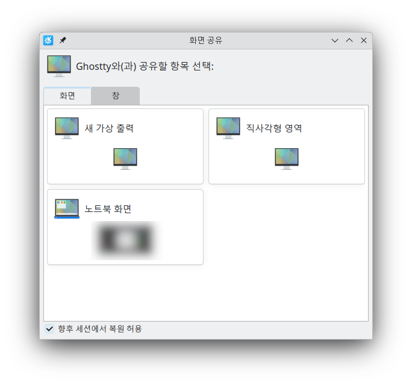
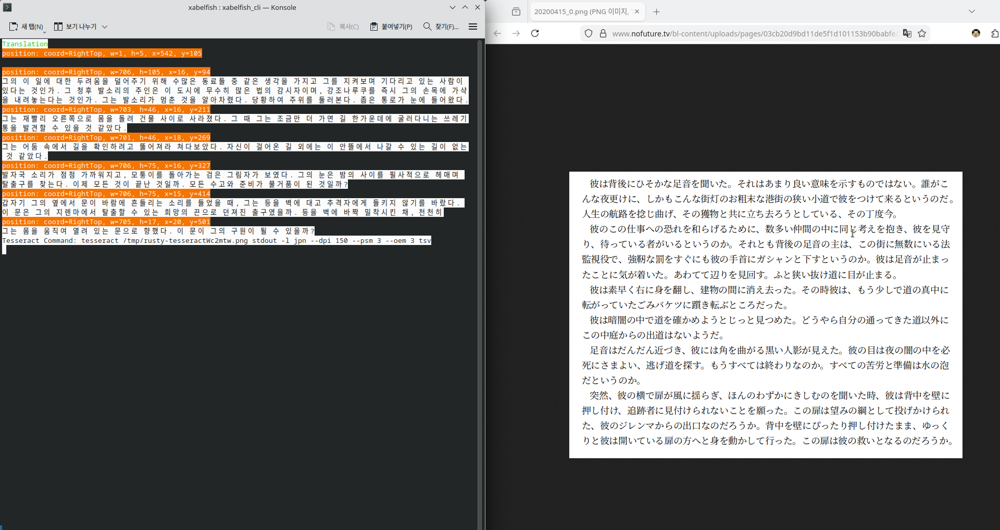

# 들어가는 글
[지난 글](/post/xabelfish_and_pipewire)에서 딱 설정창까지만 만들었었는데 [Tesseract](https://github.com/tesseract-ocr/tessdoc)의 인식률이 썩... 좋지가 않았다. 그래서 이걸 좀 사람이 쓸 수 있게 개발하려면 다른 OCR 엔진을 지원하도록 수정해야 할 필요가 있었다.

그런데 Rust를 쓰다보니 쉽지 않았다. 객체지향 프로그래밍하듯 인터페이스를 만들어서 각각의 OCR 구현체가 그 인터페이스를 구현하는 구조를 만들려고 했다. 이를 구현하려면 `dyn` 키워드를 활용해야 했는데 문제는 관련 객체가 여러 곳에서 공유되는 상태라는 것이다. 그래서 코드를 어떻게든 수정하려 해도 Rust 컴파일러가 컴파일을 거부해서... 하다가 머리에 열올라서 나중으로 미뤘다.

그래서 그 다음으로 이미지 크롭을 구현하려 했다. 알다시피, XabelFish에서는 다음과 같은 창이 뜬다.



게임 창을 선택하면 OCR결과가 쓰레기같으므로(...) 딱 텍스트 영역만 지정해야 했는데, 문제는 이러면 게임 창을 이동했을 때 영역을 다시 지정해야 했다. 이게 은근 불편해서, 아예 프로그램 내에 특정 영역만 지정해서 OCR할 수 있는 기능이 필요했다.

이를 구현하려면 [Tauri](https://tauri.app/)의 FE에 캡쳐된 이미지를 전송해야 했는데,[^1] 이거 못 하는 건 아닌데 좀 귀찮더라... 그래서 안하고 있었다.

그렇게 한 오랜시간 방치하다가 문득 생각이 나서, 일단 OCR 엔진 부분부터 손을 보았다.

# 구조 변경
## 멀티 프로세스 구조
기존에 OCR 엔진 변경 기능 구현이 매우 어려웠던 이유는 XabelFish 프로그램내에 OCR/번역/화면캡쳐 코드가 모두 들어있었기 때문이다.

그러면 OCR랑 번역이랑 화면캡쳐를 다른 프로세스로 분리하면 되지 않을까? 만약 OCR 엔진이나 번역기를 바꿔야 하면 프로세스만 바꾸면 되지 않을까?

### UNIX 도메인 소켓
프로세스간 빈번한 통신에 HTTP를 이용하는 것은 자원낭비이다. 이럴 땐 파일 소켓을 이용하면 HTTP보다 적은 오버헤드를 달성할 수 있다.

이를 위해 먼저 소켓 파일 경로를 만드는 코드부터 작성하자.
```rust
    pub fn get_temp_sock_path() -> PathBuf {
        let temp_path = NamedTempFile::with_suffix(".sock")
            .expect("Failed to create temp file")
            .into_temp_path();

        remove_file(&temp_path).expect("Failed to delete temp file");

        // remove_file doesn't gauarantee that the file will be deleted immediately...
        // so we need to wait for file to be deleted.
        while exists(&temp_path).is_ok_and(|x| x) {}

        temp_path.to_path_buf()
    }
```

rust의 [remove_file](https://doc.rust-lang.org/std/fs/fn.remove_file.html) 함수는 파일이 즉시 삭제될 것을 보장하지 않는다.

> Note that there is no guarantee that the file is immediately deleted (e.g., depending on platform, other open file descriptors may prevent immediate removal).
>
> -- [rust 공식 문서](https://doc.rust-lang.org/std/fs/fn.remove_file.html)

따라서 파일이 삭제될 때까지 기다리는 코드(윗 코드에서 `while`문 부분)가 필요하다. 없으면 소켓 만들때 이미 존재하는 파일이라고 오류난다.[^5]

UNIX 도메인 소켓은 데이터그램[^2] 방식과 스트림[^3] 방식이 가능하다. 본 프로그램을 개발할 때는 스트림 방식만을 이용했다.

먼저 연결을 받는 서버는 다음과 같다. 소켓을 bind하고 accept를 무한반복한다.
```rust
use std::{
    fs::{exists, remove_file},
    io::Error,
    os::unix::net::UnixListener,
    path::{Path, PathBuf},
};

use tempfile::NamedTempFile;

use crate::unix_socket_client::UnixSocketClient;

pub struct UnixSocketServer {
    listener: UnixListener,
    path: PathBuf,
}

impl UnixSocketServer {
    pub fn bind(path: &Path) -> Result<Self, Error> {
        let listener = UnixListener::bind(path)?;

        Ok(Self {
            listener,
            path: path.to_path_buf(),
        })
    }

    pub fn get_temp_sock_path() -> PathBuf {
        let temp_path = NamedTempFile::with_suffix(".sock")
            .expect("Failed to create temp file")
            .into_temp_path();

        remove_file(&temp_path).expect("Failed to delete temp file");

        // remove_file doesn't gauarantee that the file will be deleted immediately...
        // so we need to wait for file to be deleted.
        while exists(&temp_path).is_ok_and(|x| x) {}

        temp_path.to_path_buf()
    }

    pub fn create() -> Result<(Self, String), Error> {
        let temp_path = Self::get_temp_sock_path();

        let server = Self::bind(&temp_path)?;
        let path_string = temp_path.as_os_str().to_str().unwrap().to_string();

        Ok((server, path_string))
    }

    pub fn accept(&mut self) -> Result<UnixSocketClient, Error> {
        let (stream, _addr) = self.listener.accept()?;

        Ok(UnixSocketClient::from(stream))
    }
}

impl Drop for UnixSocketServer {
    fn drop(&mut self) {
        let _ = remove_file(self.path.as_path());
    }
}
```

그리고 클라이언트는 다음과 같다. 데이터 길이를 먼저 보낸 후, [BSON](https://bsonspec.org/) 형식의 데이터를 보내도록 했다. 어처피 동일 시스템내 프로세스 간 통신이므로 엔디언을 굳이 리틀 엔디언이나 빅 엔디언으로 고정하진 않았다. [Rust에서는 소켓이 닫히면 0 바이트를 읽는다.](https://doc.rust-lang.org/std/io/trait.Read.html#tymethod.read) 이를 이용해 데이터를 수신할 때 소켓이 닫혔는 지의 여부를 확인하도록 했다.

```rust
use std::{
    cmp,
    io::{Error, Read, Write},
    os::unix::net::UnixStream,
    path::Path,
};

use serde::{Serialize, de::DeserializeOwned};

pub struct UnixSocketClient {
    stream: UnixStream,
    closed: bool,
}

const READ_BUFFER_SIZE: usize = 1024;

impl From<UnixStream> for UnixSocketClient {
    fn from(stream: UnixStream) -> Self {
        Self {
            stream,
            closed: false,
        }
    }
}

impl UnixSocketClient {
    pub fn connect(path: &Path) -> Result<Self, Error> {
        let stream = UnixStream::connect(&path)?;
        Ok(Self {
            stream,
            closed: false,
        })
    }

    fn send_bytes(&mut self, data: &[u8]) -> Result<usize, Error> {
        let data_len = data.len();
        self.stream.write_all(&data_len.to_ne_bytes())?;
        self.stream.write_all(data)?;

        Ok(data_len)
    }

    pub fn send<T: Serialize>(&mut self, data: &T) -> Result<(), Error> {
        let serialized = bson::serialize_to_vec(data).expect("Failed to serailize to bson");

        self.send_bytes(serialized.as_slice())?;
        Ok(())
    }

    pub fn recv<'de, T>(&mut self) -> Result<Option<T>, Error>
    where
        T: DeserializeOwned,
    {
        let data = {
            let recv_result = self.recv_vec()?;
            if let Some(vec) = recv_result {
                vec
            } else {
                return Ok(None);
            }
        };

        let slice = data.as_slice();

        let deserialized = bson::deserialize_from_slice(slice).expect("Failed to deserialize bson");
        Ok(Some(deserialized))
    }

    pub fn is_closed(&self) -> bool {
        self.closed
    }

    fn recv_data_len(&mut self) -> Result<Option<usize>, Error> {
        let len_byte_count: usize = (usize::BITS / 8).try_into().unwrap();
        let mut buffer = [0; 8];
        let mut total_read_byte_count: usize = 0;

        while total_read_byte_count < len_byte_count {
            let byte_count_read = self
                .stream
                .read(&mut buffer[total_read_byte_count..len_byte_count])?;

            if byte_count_read == 0 {
                self.closed = true;
                return Ok(None);
            }

            total_read_byte_count += byte_count_read;
        }

        Ok(Some(usize::from_ne_bytes(buffer)))
    }

    fn recv_to(&mut self, vec: &mut Vec<u8>) -> Result<Option<()>, Error> {
        let data_len_option = self.recv_data_len()?;
        let data_len = if let Some(data_len) = data_len_option {
            data_len
        } else {
            return Ok(None);
        };
        let mut total_read_byte_count: usize = 0;

        while total_read_byte_count < data_len {
            let remaining_byte_count = data_len - total_read_byte_count;
            let mut buffer = [0; READ_BUFFER_SIZE];
            let bytes_to_read = cmp::min(READ_BUFFER_SIZE, remaining_byte_count);

            let read_byte_count = self.stream.read(&mut buffer[0..bytes_to_read])?;

            if read_byte_count == 0 {
                self.closed = true;
                return Ok(None);
            }

            total_read_byte_count += read_byte_count;
            vec.extend_from_slice(&buffer[0..read_byte_count]);
        }

        Ok(Some(()))
    }

    fn recv_vec(&mut self) -> Result<Option<Vec<u8>>, Error> {
        let mut vec = Vec::new();
        let success = self.recv_to(&mut vec)?;

        if success.is_some() {
            Ok(Some(vec))
        } else {
            Ok(None)
        }
    }
}

impl Drop for UnixSocketClient {
    fn drop(&mut self) {
        let _ = self.stream.shutdown(std::net::Shutdown::Both);
    }
}
```

위 서버 코드는 멀티 클라이언트를 고려하지 않았지만, 어처피 프로세스간 단순한 내부통신 목적이니 크게 상관없다.

### 호스트-클라이언트 구조
XabelFish를 호스트-클라이언트 구조로 재작성했다. XabelFish는 OCR, 번역, 화면캡쳐를 위한 각각 세개의 UNIX 소켓을 열고, 자식 프로세스 실행시에 소켓 경로를 인자로 전달한다. 그러면 자식 프로세스는 전달받은 소켓에 접속하여 데이터를 주고받는다.

그러면 이제 자식 프로세스가 예기치 않게 종료됐을 시 다시 실행하는 기능을 구현해야 한다. 이를 구현하기 위해서는 자식 프로세스가 살아있는 지를 확인해야 한다.

이를 위해 처음에는 [sysinfo](https://crates.io/crates/sysinfo) 라이브러리를 이용해 자식 프로세스가 살아있는 지를 주기적으로 확인하려 했는데, 생각한대로 동작하지 않았다. 그래서 그냥 Lock-file 방식을 이용하기로 했다.

구현하는 방법은 매우 간단한다. 먼저 호스트에서 자식 프로세스를 실행할 때 lock file 경로를 인자로 전달한다. 그러면 자식 프로세스에서는 다음과 같이 lock file의 lock을 취득한다.

```rust
    let args = CommandArgs::parse();

    let lockfile = File::open(args.lock_file).unwrap();
    lockfile.lock().expect("Failed to get a lock");
```

그리고 호스트에서는 주기적으로 lock file의 lock 획득을 시도한다. 만약 성공하면 자식 프로세스가 죽은 것이고 실패하면 살아있는 것이다. 이렇게 판단하면 된다.

```rust
    pub fn is_alive(&self) -> bool {
        let lockfile = File::open(self.lockfile.clone());

        if let Ok(lockfile) = lockfile {
            lockfile.try_lock().is_err()
        } else {
            false
        }
    }
```

#### 호스트
호스트에서는 총 4개의 쓰레드가 실행된다.
- OCR 자식 프로세스랑 통신하는 쓰레드
- 화면 캡쳐 프로세스랑 통신하는 쓰레드
- 번역 프로세스랑 통신하는 쓰레드
- 자식 프로세스가 죽었는지 확인하는 쓰레드 (겸사겸사 번역기나 OCR 엔진 설정이 바뀌면 기존 프로세스를 죽이고 다른 프로세스를 실행하는 역할도 한다.)

쓰레드간에 데이터를 서로 주고받으면서 최종적으로 번역결과물이 나온다.

이론적으로는 중간에 번역기나 OCR 엔진 종류를 바꿀 수도 있지만 실제로 잘 되는 지는 테스트해보지 않았다. 이건 나중에 테스트하는 거로...

# 결과물
원래 게임으로 테스트하려 했는데 실행이 안되서[^4] 그냥 [인터넷에 있는 더미 텍스트](https://www.nofuture.tv/20200415)로 테스트해봤다.



잘 되는 것 같다. 이제 GUI만 만들면 되는데... 프로그램 특성상 멀티쓰레딩이 필연이라서 무슨 선택을 하던간에 만들기가 너무 귀찮다... 고민해봐야지...

---
[^1]: 일단 뭐가 보여야 영역을 지정하니까.
[^2]: UDP와 유사하다.
[^3]: TCP와 유사하다.
[^4]: 최근에 노트북에 있던 Arch Linux를 밀고 Fedora로 바꿨다. 그래서 아직 설정이 덜 됐다.
[^5]: 덕분에 삽질 좀 했다.